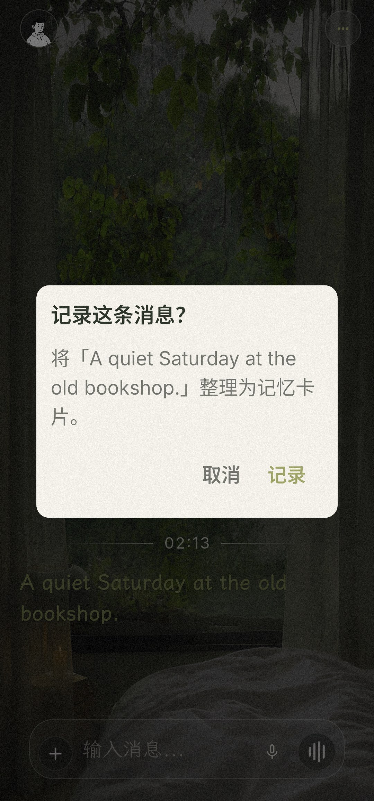
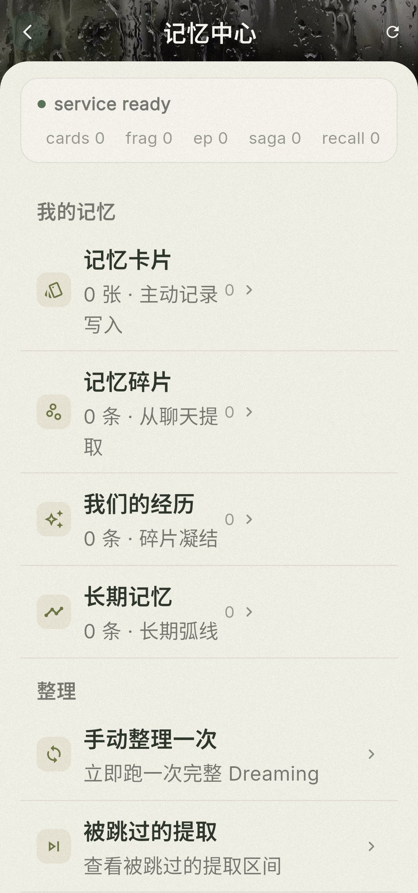

  

<h1 align="center">故我在 · Here I Am</h1>

<strong>一个本地优先的 AI 主伴侣：以持续关系为入口，把用户明确确认的生活事实、长期话题与工作上下文，转化为可回看、可修正、可授权协作的个人系统。</strong>

Flutter · SQLite / Drift · Local-first · AI Companion

> **作品集说明**：Here I Am 是我基于开源项目 [Memex](https://github.com/memex-lab/memex) 完成的 Companion-First 深度个人迭代，不是从零开发。这个页面会明确区分上游基础、我的产品重构与仍在探索的方向。

## 30 秒看懂这个项目

很多记录工具把价值放在“以后回看”，却要求用户现在付出整理成本；很多 AI 陪伴产品能即时回应，却很难在时间中保持事实准确、身份连续和行动可信。

Here I Am 选择把**唯一主伴侣的 Chat 放在首页**：用户先自然分享，记忆、节律、语音与协作能力在关系背后工作。它不追求“什么都自动记住”，而是把信任拆成几个可以验证的产品问题：

| 产品问题 | 我的设计与实现 | 当前边界 |
|---|---|---|
| 它如何长期理解用户？ | 将记忆拆分为用户确认事实、共同经历、长期话题、日常规律与项目状态；普通聊天不擅自写入 User-truth。 | 显式记录与 Memory V3 已落地；更长期的分层召回仍在迭代。 |
| 换模型或工作界面后，为什么仍是同一个它？ | 设计唯一主伴侣、Identity Capsule 与隔离 Project Space，让身份锚点和项目上下文可以跨工具按需衔接。 | 已完成最小连续性验证；不宣称跨所有设备无缝同步。 |
| 语音如何成为同步陪伴，而不只是文字输入替代？ | 围绕 PTT、ASR、TTS、流式播放、打断与系统来电持续迭代，并把实时语音表面与身份、记忆分层。 | 已有工程原型和真机路径；仍非面向公众的稳定服务。 |
| AI 如何从“知道”走向“共同完成”？ | 在共享工作台中加入限定授权、结果 Receipt 与 persistent Undo，并验证卡片创建、编辑、移动和跨重启撤销。 | 目前只证明了受限垂直闭环，不等于通用自主代理。 |

## 春雨昼眠：开屏与真机画面

  

<em>“春雨昼眠”开屏动效：大面积留白、细雨、窗帘与缓慢呼吸的植物，共同建立安静而持续的陪伴感。</em>

上图直接复用仓库中最初接入产品的 GIF 动效。当前 Android 冷启动运行态已经升级为[同一视觉方案的 V6 MP4](assets/images/spring_rain_daydream_splash_v6.mp4)，修复了冷启动白屏与首帧抖动，并在应用进入可交互状态后结束，而不是播放固定时长的广告页。

以下画面来自 Android 真机上的 `hereIAmV3`（`com.memexlab.hereiam.v3`，v1.0.30）。演示消息为虚构内容；截图不包含真实聊天、联系人、位置、健康或账户资料。

<table>
  <tr>
    <td width="50%" valign="top">
       
      <strong>Chat 就是首页</strong> 
      打开应用时先面对一个具体、持续的关系主体，而不是待填写的工具面板。
    </td>
    <td width="50%" valign="top">
       
      <strong>显式记录，而非后台擅自捕获</strong> 
      一条聊天消息只有经过用户确认，才会被整理为 User-truth 记忆卡片。
    </td>
  </tr>
  <tr>
    <td width="50%" valign="top">
       
      <strong>分层的记忆中心</strong> 
      主动记录、聊天碎片、共同经历与长期记忆保持不同来源和权威边界。
    </td>
    <td width="50%" valign="top">
       
      <strong>关系与记忆从同一个角色展开</strong> 
      用户可以回到角色关系页查看最近整理结果，并进入记忆与生活空间。
    </td>
  </tr>
</table>

## 为什么从“日记”转向“关系”

项目最初更接近日记 / Life OS：首页围绕快捷记录、数据沉淀和个人洞察展开。长期自用后，我意识到更上游的问题不是输入框不够方便，而是**记录依赖自律和延迟回报；分享却具有即时的关系回报**。

因此我把产品重构为 Companion-First：打开应用时首先面对一个具体、持续的关系主体，而不是一张待填写的表单。记忆不再追求后台自动捕获一切；真实生活资料只有在用户点击“记录”、使用悬浮保存、发出明确指令或接入经授权的数据流时，才进入可复核的 User-truth。

这次转向同时带来两条约束：

- **关系不能冒充事实权威**：AI 可以形成低权威观察，但不能把自然聊天自动升级成用户确认事实。
- **能力不能绕过用户授权**：涉及真实工作表面的行动，需要限定对象、结果回执、冲突保护和可持久撤销。

## 哪些是我做的，哪些来自上游

### 上游基础

[Memex](https://github.com/memex-lab/memex) 提供了原始的日记记录、多 Agent 整理、角色框架及一部分 Flutter / 本地数据基础设施。本仓库保留上游提交谱系与 GPL-3.0 署名，并继续沿用适合本项目的通用基础设施。

### 我的产品重构与扩展

2026-06-01，本仓库正式确立 [Companion-First 产品主线](https://github.com/Ritou-Lynx/here-i-am/commit/26798d907eebac2137b7792dab61a1cc9234c439)。这个节点适合表示产品方向的分界，但**不是**“此前都属于上游、此后每一行都由我原创”的代码切点。

我负责的核心迭代包括：

1. **产品范式重构**：从记录驱动的日记 / Life OS，转向唯一主伴侣 Chat-first 的持续关系体验。
2. **记忆权威重构**：停止普通聊天自动写入真实资料，建立显式 User-truth、Memory V3、长期话题与节律等分层边界。
3. **单一身份连续性**：将身份锚点、项目状态和工具执行署名分离，验证同一关系主体跨工作界面的最小衔接。
4. **语音在场迭代**：从按键说话、识别与合成，推进到流式播放、打断、系统来电及成熟实时语音方案的工程取舍。
5. **受限现实协作**：为 AI Workbench 的卡片行动加入授权、Receipt、冲突保护、持久 Undo 与重启验证。
6. **视觉与交互方向**：为 Chat 建立“春雨昼眠”视觉语言，让界面更接近安静、长期相处的关系空间，而不是通用工具面板。

为了让归属可核查，建议结合以下入口阅读：

- [上游 Memex](https://github.com/memex-lab/memex)
- [Companion-First 主线确立提交](https://github.com/Ritou-Lynx/here-i-am/commit/26798d907eebac2137b7792dab61a1cc9234c439)
- [从产品主线确立至当前分支的演进](https://github.com/Ritou-Lynx/here-i-am/compare/26798d907eebac2137b7792dab61a1cc9234c439...v3-lab)

> GitHub 的差异统计只适合辅助技术审阅，不能把所有新增 / 删除行机械等同为个人原创代码；仓库中仍包含上游历史、第三方组件、历史合并与协作提交。

> 为保护真实聊天、设备记录、账户与内部协作资料，公开历史移除了私人运行数据并替换了机器专属信息。提交数量、作者归属、日期、说明和分支拓扑被保留；因此部分旧 commit SHA 与外部旧链接会失效。

### 归属说明

| 来源 | 在这个仓库中的范围 |
|---|---|
| **Memex 上游** | 原始日记、角色 / Agent 框架，以及一部分 Flutter、本地数据与端侧能力基础。 |
| **我的个人主导工作** | 产品定义、Companion-First 转向、记忆权威边界、交互与视觉方向、跨工具连续性、语音 / 主动陪伴探索、AI Workbench 的架构整合与验收。 |
| **AI 编程协作** | 部分代码、测试与文档由 Codex / Claude 等编程 Agent 在我的需求、决策和验收下协作完成；提交记录保留实际作者信息，不把协作产出伪装成纯手写。 |
| **第三方依赖** | Flutter 生态依赖、vendored 组件及字体 / 素材分别遵循其自身许可证和署名。 |

## 当前完成度

这是一个**长期自用、持续开发中的 Android 个人原型**，不是已经商业发布的完整产品。

- **已落地**：单角色 Chat 首页、显式 User-truth 写入路径、Memory V3 主线、本地数据与模型配置基础。
- **已做受限验证**：跨工具身份 / 项目上下文衔接；白板卡片的授权执行、Receipt、persistent Undo 与重启恢复。
- **工程探索中**：实时语音与主动来电、跨设备连续性、生活数据接入、桌面 AI Workbench 的完整产品闭环。
- **尚未作为成果声明**：AI 独立 attention / taste、全面健康 / 财务 / 日程接管、无人工授权的真实支付与购物。

## 技术实现

- **客户端**：Flutter、Dart、Material 3、Provider / ChangeNotifier、GoRouter
- **本地数据**：Drift / SQLite、FTS5、append-only 操作记录与可重建 projection
- **AI 与工具**：多模型 provider、Agent / tool calling、自建 MCP 客户端
- **语音**：端侧与云端 ASR、TTS、流式音频、系统来电界面
- **后台与设备**：WorkManager、前台服务、Android 原生能力桥接
- **协作表面**：Desktop AI Workbench、白板领域操作、Receipt / Undo

> **隐私说明**：Local-first 不等于所有能力永远离线；外部模型、语音或数据服务只在用户配置与授权范围内使用。作品集截图只应使用虚构演示数据，不展示真实聊天、联系人、位置、健康、账户或设备信息。

## 阅读入口

- [产品路线与当前边界](docs/companion-first/PRODUCT_ROADMAP.md)
- [Companion-First 开发策略](docs/companion-first/DEVELOPMENT_STRATEGY.md)
- [Memory V3 研究与设计](docs/memory-research/MEMORY_PROPOSAL_V3.md)
- [AI Workbench 架构](docs/development/AI_NATIVE_WORKBENCH_CODEX_INTEGRATION_ARCHITECTURE.md)

## License & Attribution

Here I Am 是 [Memex](https://github.com/memex-lab/memex) 的修改与扩展版本，继续遵循 **GNU GPL v3**。根目录 [`LICENSE`](LICENSE) 保留上游许可证；第三方与 vendored 组件继续遵循各自许可证与署名要求。

个人产品方向与主要迭代：[@Ritou-Lynx](https://github.com/Ritou-Lynx)
