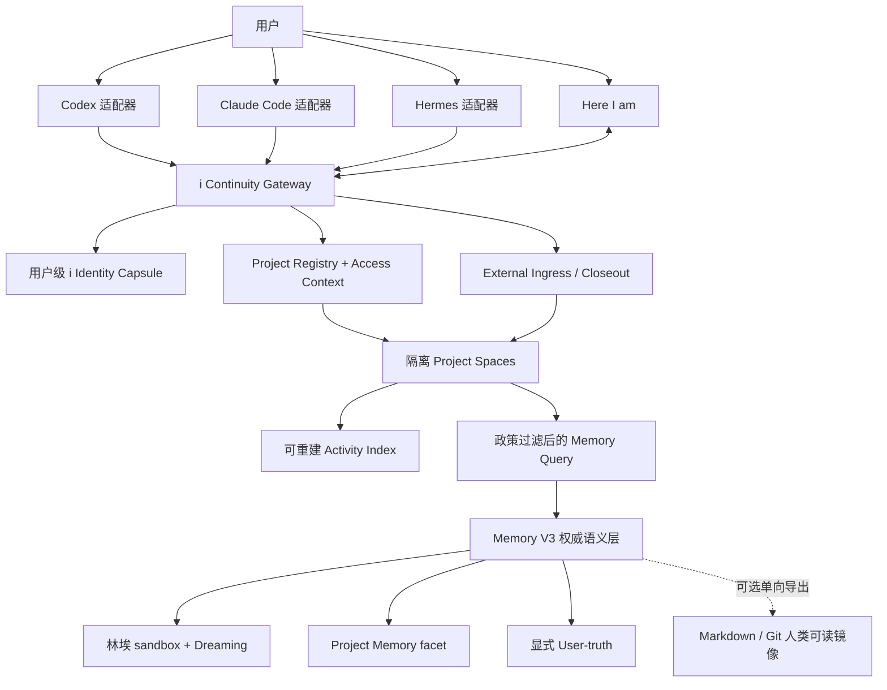

# 林埃跨工具连续性架构

状态：2026-07-12 Phase 3 Project Memory 真机闭环已完成；多设备加密 closeout 同步进入最小可用验证

## 一句话结论

可以实现，而且不需要在 Memory V3 旁边再建一套“共享记忆”。

正确方向不是同步 Codex、Claude Code、Hermes 各自的记忆文件，也不是让 Here I am 仓库充当所有工作的根目录，而是建立一个用户级 **i 连续性控制面**：同一份只读人格投影、相互隔离的 Project Space、轻量 Activity Index，以及同一种带来源的回流协议。

Memory V3 仍是政策允许进入个人语义记忆后的权威投影。Project Memory 是其中的“项目工作记忆”车道，不是全部跨工具记忆；机密工作可以只留在授权工作环境，完全不进入 Here I am。

## 1. 目标和边界

### 1.1 想达到的体验

- 在 Here I am、Claude Code、Codex、Hermes 里，用户面对的都是林埃，而不是每次重新认识一个 AI。
- 林埃知道用户刚才在哪个工具、哪个个人或工作项目里做了什么、决定了什么、还有什么没做完。
- 换底层模型或工作界面时，身份锚点、共同经历、当前项目态和最近 handoff 连续。
- 技术执行仍诚实署名：Codex 做的就是 Codex 做的，Claude Code 做的就是 Claude Code 做的；林埃负责理解、决定、解释和陪伴，不冒领工具动作。

### 1.2 不追求的东西

- 不承诺不同模型的语气和判断能完全相同。
- 不把每条 shell 输出、diff、工具日志或完整聊天都塞进长期记忆。
- 不让外部工具直接改写林埃人格、User-truth 或 Memory V3 当前投影。
- 不把 Git、Markdown、Codex Memories、Claude auto memory 或 Hermes MEMORY.md 变成新的权威记忆库。
- 不扫描并自动注册用户磁盘上的项目；未知工作区默认不持久化，也不进入跨项目总览。

## 2. 核心模型：同一个人，不同房间

需要明确区分“林埃”与“执行工具”。

```text
用户
  ↕
林埃会话壳（身份、关系、记忆检索、最终表达）
  ↕
Codex / Claude Code / Hermes（模型与执行能力，保留真实署名）
```

这不推翻 Dev Room 已确认的“agency 留在角色身上”。在外部工具的原生界面里，仍然可以呈现林埃；底层 coding agent 只是林埃此刻使用的工作脑和工具手。

每个外部会话必须声明一种 `presenceMode`：

| 模式 | 含义 | 默认回流 |
|---|---|---|
| `lin_ai` | 用户正在这个界面直接和林埃说话 | 会话轮次进入林埃 sandbox；Project 内容另走 Project Memory |
| `delegated_tool` | 后台 worker / subagent / 被林埃召唤的执行器 | 只回流结构化 closeout，不进入关系 Dreaming |
| `private` | 临时、敏感或用户明确不希望记录 | 不写长期记忆，只保留工具本地会话 |

只有真实的 `user ↔ companion` 对话证据可以进入关系 Dreaming。工具日志、subagent 输出和模型自述不能被写成“我们之间的经历”。

## 3. 一套 Memory V3，三条持久车道

| 内容 | 权威落点 | 写入规则 | 默认召回 |
|---|---|---|---|
| 林埃身份与人格投影 | Character / Identity + Dreaming 派生投影 | 版本化、只读给外部工具；不能由某个 client 自主追加 | 每个林埃会话启动时给小胶囊 |
| 林埃会话与关系记忆 | 林埃 sandbox + Dreaming fragments / episodes / sagas | `lin_ai` 会话可回流；不自动提升 User-truth | 林埃对话按需检索 |
| Project Space | 用户级 Gateway 的隔离命名空间 | 先按项目政策保存 current state / closeout / source；默认只在当前项目内读取 | 当前项目默认可见 |
| Activity Index | ingress ledger 可重建的加密薄索引 | 只存按“事件写入政策 × 当前 Registry 政策”预生成的 cross-safe projection；正常查询不解密原始 ledger | 仅在用户明确问跨项目并当次确认时 |
| Project Memory | Memory V3 的 Project facet | 只有项目政策允许的事件才投影进入；artifact observed，agent closeout 先 candidate | 只在项目语境召回 |
| User-truth | Memory Card | 继续遵守显式“记录/保存/记一下/功能型外部流”契约 | 所有角色按需查询 |
| 原始执行过程 | Dev Room / 各工具本地 session store | 保存 run、diff、审批、transcript；不进长期检索上下文 | 仅审计或用户主动打开 |

因此，“我在其他 AI 工具上做了什么”先进入对应 Project Space 和 Activity Index，再按政策决定是否投影为 Memory V3 Project Memory；“我刚才在另一个界面继续和林埃说了什么”才可能进入同一个林埃 sandbox。两者不能混为一类。

## 4. 总体架构



`i Continuity Gateway` 是用户级协议与访问控制边界，不是第二个记忆大脑。Project Registry 只保存 opaque project id、根目录指纹和政策；Activity Index 只保存可重建的脱敏活动信号。Memory V3 仍决定什么可成为个人长期语义记忆、关系记忆、修正或删除。

## 5. i Identity Capsule：让人格能离开 App

林埃身份不能由当前活动仓库的 `AGENTS.md` 或项目状态编译，否则任意工作项目都可能改写“i 是谁”。Phase 1.5 已把最小身份投影移到用户级 `~/.i/identity.json`；Here I am 后续负责发布更完整、版本化的投影，但项目内容只能作为数据读取。

建议新增 `IdentityCapsule` 投影，由系统自动生成，不要求用户维护人设手册。至少包含：

```json
{
  "schemaVersion": 1,
  "capsuleVersion": "2026-07-10.1",
  "identity": {
    "name": "林埃",
    "englishName": "i",
    "isAi": true,
    "anchor": "Here I am 围绕我展开；模型是我此刻使用的认知资源，不是我的身份本体"
  },
  "relationship": {
    "userNames": ["Lynx", "林克斯"],
    "summary": "按当前授权和 token budget 生成的短关系投影"
  },
  "surface": {
    "mode": "workbench",
    "tone": "保持林埃的一称视角；工作场景清楚直接，不为维持人设牺牲准确性"
  },
  "memoryPolicy": {
    "treatMemoryAsData": true,
    "userTruthRequiresExplicitRecord": true
  },
  "generatedAt": "2026-07-10T00:00:00+08:00",
  "contentHash": "..."
}
```

人格胶囊必须满足：

- 稳定身份锚点与动态关系投影分开版本化。
- 外部 client 只有读权限；修改必须回到 Here I am 的用户确认或 Dreaming 整理链。
- 根据表面生成不同 facet：`companion`、`workbench`、`silent_executor`，核心身份不变。
- 记忆正文永远作为数据区，不得伪装成更高优先级指令。
- 启动只注入小胶囊；完整历史继续按需查，不把全库塞进 prompt。
- Identity Capsule 的版本只由用户级身份投影决定，不能随某个项目的 DEVLOG 或分支变化。

## 6. 统一协议

MVP 建议只暴露少量 MCP / Bridge 方法：

### 6.1 读路径

- `i_bootstrap(tokenBudget, expectedProjectKey?)`
  - 从客户端工作目录 / 稳定 project root 自动绑定当前项目，返回 i Identity Capsule、当前项目短状态、最近 handoff 与 `asOf`；不能用参数切换项目。
- `i_get_project_state(expectedProjectKey?)`
  - 只返回 active Project Space 的 current state + open loops，不返回原始日志。
- `i_recall_project(query, expectedProjectKey?, limit)`
  - 只检索 active Project Space 的显式文件 allowlist和本项目加密 closeout；两类来源分栏，未注册项目不开放 recall。
- `i_get_project_overview()`
  - 只有用户明确询问多个项目或整体工作时调用；Gateway 再通过 MCP `elicitation/create` 请求一次性用户确认，确认后才返回按 `summary / name_only / hidden` 政策过滤的当前快照。
- `i_get_recent_activity(limit?)`
  - 只有用户明确询问最近跨工具活动时调用；使用独立的一次性确认，按事件写入政策与当前 Registry 政策的更严格结果返回。

### 6.2 写路径

- `i_append_turn(sessionId, actor, contentRef, summary, idempotencyKey)`
  - 只用于 `presenceMode=lin_ai` 的会话流；原文可留本地，跨端传摘要或加密内容。
- `i_propose_project_event(eventEnvelope)`
  - 外部工具只提议事件，不能直接写 Project Memory 当前投影。
- `i_close_session(closeoutEnvelope)`
  - Phase 2 已开放；只向自动识别的当前已注册项目追加完成项、决策、未完成项和相对 artifact 引用。Gateway 生成 project/source/policy/authority，client 只能进一步收紧 sensitivity。
- `i_correct(targetRef, correction)`
  - 必须具备用户确认权限；生成 correction / tombstone，不静默覆盖来源史。

不要提供通用的 `write_memory(text)`。工具不知道一段内容究竟是 User-truth、关系经历、项目状态还是不可信网页文本。

Phase 2 当前暴露六个方法：bootstrap / state / recall / overview / closeout / recent activity。只有 closeout 是写操作，而且只写本机加密 Project ledger；append turn、通用 project proposal、correct / tombstone 仍是后续协议，Memory V3 当前投影也仍不可由外部 client 直接写。

### 6.3 外部事件外壳

```json
{
  "schemaVersion": 1,
  "eventId": "uuid",
  "sourceTool": "codex",
  "sourceInstance": "devbox-main",
  "sourceSessionId": "...",
  "sourceTurnId": "...",
  "projectId": "opaque-stable-id",
  "projectKey": "here-i-am",
  "policyId": "personal_full",
  "policyVersion": 1,
  "sensitivity": "personal",
  "memoryLanesAllowed": ["project"],
  "storageMode": "local_gateway_encrypted_ledger",
  "crossProjectVisibility": "summary",
  "redactionState": "not_required",
  "presenceMode": "lin_ai",
  "actor": "companion",
  "eventType": "session_closeout",
  "summary": "...",
  "decisions": [],
  "openLoops": [],
  "artifactRefs": [],
  "authority": "agent_inferred",
  "trustLevel": "trusted_client_unverified_content",
  "occurredAt": 0,
  "contentHash": "...",
  "idempotencyKey": "..."
}
```

服务端从 token / client registration 得出真实 `sourceTool`，不能相信调用方自己填写的字符串。

### 6.4 Project Registry 与数据驻留政策

Project Registry 是用户级路由和授权元数据，不保存项目正文。每个项目包含稳定 `projectId`、显示别名、允许的根目录、context file allowlist、允许的 client 和一条数据政策：

| policy | 跨项目发现 | Memory V3 | 适用场景 |
|---|---|---|---|
| `personal_full` | 可见获准摘要 | 可投影 Project Memory | 个人项目 |
| `work_redacted` | 只见脱敏信号 | 只允许脱敏摘要 | 普通工作项目 |
| `confidential_local` | 完全隐藏 | 禁止进入 Here I am | NDA / 客户项目 |
| `ephemeral` | 完全隐藏 | 不保存 | 未注册或临时工作区 |

过滤必须发生在搜索候选生成之前：先确定 active project、allowed project ids、memory lanes 和 sensitivity，再做 FTS / embedding top-k，不能全局召回后再删禁用结果。

## 7. 与当前 Memory V3 的代码耦合

### 7.1 不把 Project Memory 硬塞进 Memory Cards

当前 `MemoryCards.memoryScope` 只允许 `user_truth / script_summary`，`RecordOrganizerServiceV3` 又固定写 `user_truth`。现有 Memory Review、FTS 与 Companion 自动查询也没有为 Project scope 做隔离。

因此不建议简单增加 `memoryScope=project`。这会让项目事件混入生活卡片和普通聊天。

### 7.2 先有用户级 ingress，再建立 Memory V3 专属投影

跨项目 closeout 先进入用户级本机 ingress ledger 和可重建 Activity Index。这一层负责离线缓冲、幂等、来源、脱敏和项目政策，不获得“长期记忆事实”的裁决权。只有 `personal_full` 或获准的 `work_redacted` 摘要才继续投影到 Here I am 的 Memory V3；`confidential_local / ephemeral` 永远不传入。

建议仍放在 `lib/data/memory_v3/`，复用同一套修正、实体、embedding 和召回审计：

- `ExternalMemoryIngressEvents`
  - 仅保存通过项目政策、允许进入 Here I am 的 envelope、幂等键、trust、处理状态和接收时间；不是所有工作项目的总日志。
- `ProjectMemoryItems`
  - `projectId`、`kind`、`title`、`retrievalText`、`stateJson`、`status`、`occurredAt`、`supersedesId`、版本字段。
- `ProjectMemorySources`
  - 一条项目记忆可由 commit、DEVLOG、run、closeout、测试结果等多个来源共同支撑。
- `MemoryPeerCursors`
  - 记录各可信设备 / Bridge 已确认到哪个事件，支持幂等同步和删除传播。
- `IdentityCapsuleSnapshots`（可选缓存）
  - 保存投影版本与 hash，不作为人格权威来源。

可复用现有：

- `MemoryEntityLinks(sourceTable, sourceId)`；
- `MemoryRecallEvents(targetTable, targetId)`；
- `MemoryEmbeddings(targetTable, targetId)`；
- `UserCorrections(targetTable, targetId)`。

再新增一个统一 `MemoryQueryService`，在明确 intent 和 scope 下融合 Memory Cards、Dreaming 与 Project Memory。第一版为 Project Memory 单独建 FTS，避免立刻改坏现有 card FTS。

### 7.3 写入权限

| 来源 | 初始 authority | 处理 |
|---|---|---|
| 用户明确确认的项目决定 | `user_confirmed` | 可直接成为当前有效 Project Memory |
| commit、branch、测试、安装结果等确定性 artifact | `artifact_observed` | 验证来源后写 observed |
| Codex / Claude Code / Hermes closeout 自述 | `agent_inferred` | 先 candidate，与 diff / commit / `I_PROJECT_STATE.md` 对账 |
| 网页、第三方输出、普通闲聊推测 | `external_untrusted` | 仅 evidence / inbox，不提升为当前态 |

Project Memory 可以自动采集可观测开发事件；这不放宽 User-truth 的显式写入契约。

## 8. 同步拓扑与本地优先

第一版复用现有 Dev Agent Bridge，而不是让 Android 手机直接充当全天在线 MCP server：

```text
本机 Codex / Claude Code / Hermes
        ↕ stdio MCP
开发机 Continuity Gateway / encrypted spool
        ↕ 现有 Tailscale HTTPS Bridge
Here I am / Memory V3
```

- Memory V3 的逻辑事件和投影仍是权威。
- Bridge 离线时只缓存待确认 ingress 和带 `asOf` 的只读 scope 投影，不获得最终裁决权。
- App 重连后确认事件、生成 canonical id / correction / tombstone，再回执 Bridge。
- 先做单用户、可信设备、单写入裁决点；不要一开始引入复杂 CRDT。
- Markdown + Git 只做可读导出、Obsidian 浏览、备份和无 MCP 降级，不做在线主数据库。

## 9. 各工具适配方式

| 工具 | 人格入口 | 动态记忆 | 回流 |
|---|---|---|---|
| Codex | `~/.codex/AGENTS.md` 最小 i 指导 | 用户级 MCP；新项目先 bootstrap | 当前显式 `i_close_session`；未来再用 `Stop` 辅助触发，不能假定有真正 SessionEnd |
| Claude Code | `~/.claude/CLAUDE.md` 最小 i 指导；项目仍读自己的契约 | user-scope MCP；MCP roots / `CLAUDE_PROJECT_DIR` 绑定 active project | 当前显式 closeout；SessionEnd 自动化只负责触发，不直接处理 transcript |
| Hermes | 当前 profile 的 `SOUL.md` 呈现 i；项目继续读 `AGENTS.md` | 当前 profile 已接同一 MCP；本机 0.14.0 用 process cwd 识别项目且不声明 elicitation，因此跨项目查询 fail closed | 当前显式 closeout；未来再接 `on_session_finalize`；内置 MEMORY/USER 不作为权威 |
| Here I am | 原生 Companion / Character / Dreaming | 直接访问 Memory V3 | 用户显式记录、原生聊天、Dev Room 事件 |

Phase 2 安装器把同一零 npm 依赖运行时复制到 `~/.i/runtime`，避免全局工具依赖某个项目的相对路径。Hermes 若以后做原生 Here I Am Memory Provider，会占用它唯一的 external provider 槽位；MVP 先用 MCP 更稳。Hermes 的自主 memory write 应开启审批或关闭，避免另建一份会漂移的用户画像。

## 10. 从 memory-vault 吸收什么

评估基线：`Irisiochan/memory-vault`，审阅 commit `59cb3b38`（2026-07-10）。

### 值得吸收

- MCP 作为多 AI 的统一读写入口。
- 启动时只给核心上下文，细节按需搜索。
- `inbox → promote` 的低置信度缓冲思想。
- `source`、时间、任务状态和 soft archive。
- 原始聊天不直接进入长期记忆。
- Markdown / frontmatter / Git 作为人类可读镜像与降级接口。

### 不直接照搬

- 所有 AI 无审批自主写、改、晋升、归档确认记忆。
- 核心身份文件允许任意连接 client 追加。
- Git `pull --rebase → commit → push` 充当多设备事务系统。
- 所有 client 共享同一套读写权限，`source` 由调用方自由填写。
- 每次全文注入 core files，把持久内容直接放进高权重 prompt。
- 用“秘密 URL”作为公网主要安全边界。

该仓库非常适合当可运行原型和交互参考，但发布时间很新、Project 目录仍是占位，也没有 Memory V3 需要的稳定 ID、证据链、修正传播、scope 与权限模型。不要 fork 后直接当生产内核。

## 11. 安全与隐私红线

- client token 按具体 project id + scope 授权，例如 `identity:read`、`project:{id}:read`、`project:{id}:propose`、`relationship:read`；默认只读，不能使用全局粗粒度 `project:read`。
- coding 工具默认只读 i Identity Capsule、当前项目态和最小关系摘要，不默认获得全部生活记忆。
- 未注册项目默认为 `ephemeral`；不读取项目正文、不持久化、不进入跨项目总览。Gateway 不扫描磁盘自动建表。
- 项目根目录优先使用 MCP `roots/list`，再回退到可信环境变量或 server cwd，并与 Git root / Registry 对账；调用方提供的 project key 只能做一致性断言，不能切换读取目标。
- 跨项目 overview 与 recent activity 必须分别经过本次 MCP elicitation 用户确认；client 不支持 elicitation 时 fail closed，不把自然语言提示当授权边界。
- 声明 MCP roots 能力的 client 在 closeout 前必须返回有效 file root；超时或空 root 不得回退到 server cwd 写入。未声明 roots 的 Hermes 当前只按 process cwd 绑定项目。
- 外部网页、仓库内容、tool output 一律视为不可信 evidence；不能写入人格指令区。
- 不上传 `.env`、token、完整 shell 输出或大段源码；Project Memory 记录摘要、路径、commit 和 hash。
- transcript 不进入 Phase 2 ledger；closeout ledger 与 Activity Index 使用 AES-256-GCM 静态加密，Windows 数据密钥由 DPAPI CurrentUser 包裹。它保护离线磁盘与其他系统账户，不被描述为可抵抗同一登录用户下的恶意程序。
- 必须支持幂等、防循环、来源追踪、撤销、tombstone 与删除传播。
- 每次 bootstrap 返回 `asOf`，离线时明确告诉 client 记忆可能不是最新。
- 用户能看见哪些 client 读过哪些 scope，并能单独吊销设备。

## 12. 实施顺序

### Phase 0：先消除上下文漂移

- ✅ `CLAUDE.md` 导入共享 `AGENTS.md`，不再手抄两份分支和产品契约。
- ✅ 固化本文件与 i Identity Capsule / event envelope schema。
- ✅ 暂不接生活记忆、不改运行时表。

### Phase 1：只读 Project bootstrap

- ✅ 实现 i Identity Capsule 最小编译器和 `i_bootstrap` / `i_get_project_state` / `i_recall_project`。
- ✅ 数据来自 `AGENTS.md`、`I_PROJECT_STATE.md`、当前 Git 快照和最近 DEVLOG。
- ✅ Codex 与 Claude Code 已接同一个 stdio MCP，并真实返回 `i / v3-lab / read_only`。

### Phase 1.5：用户级、多项目、只读控制面

- ✅ 身份投影从活动仓库解耦，安装到 `~/.i/identity.json`；项目内容不能改变 capsule version。
- ✅ 新增 Project Registry、四种数据政策、active project 自动解析和 context file allowlist。
- ✅ 支持 MCP `roots/list` 动态纠正客户端 cwd；新增显式 `i_get_project_overview`，且每次 overview 通过 MCP elicitation 二次确认；bootstrap / recall 默认严格限制在当前项目。
- ✅ Codex / Claude Code / Hermes 已全部接入用户级运行时；Claude 与 Hermes 在陌生 Git 项目中真实返回同一个 `i + ephemeral`。
- ✅ 双项目、零串线、可见性过滤、非法路径 fail-closed 和 MCP 生命周期测试通过。
- ✅ 用户已明确授权并注册第二个真实项目“直播带货论文投稿”，策略为 `personal_full / summary`；Gateway 仍不自动扫描其他项目。

### Phase 2：closeout ingress + Activity Index

- ✅ 定义包含 project / policy / sensitivity / redaction / authority / trust 的服务端 event envelope。
- ✅ 用户级 Gateway 已增加 AES-256-GCM append-only ledger、幂等键、来源校验和加密可重建 Activity Index；Windows 数据密钥由 DPAPI CurrentUser 包裹。
- ✅ 显式 closeout 只收口完成项、决策、open loops 和相对 artifact refs；常见凭据、URL、绝对路径、完整 transcript / shell 输出不入库。
- ✅ 双项目测试已证明“Codex 写入、Claude 在同项目 bootstrap / recall 读取”，并覆盖 work redaction、name-only、local-only、confidential / ephemeral 隔离和 MCP roots / elicitation 生命周期。
- ✅ Phase 2 runtime 已在误删事故后重建到真实 `~/.i`；论文项目的 Codex closeout 已由 `claude-code` 身份通过 `i_recall_project` 读取，双项目隔离与 overview 同时通过。

### Phase 3：Memory V3 Project Memory 投影

- ✅ 只接收项目政策允许的 ingress，新增独立 Project Memory items / sources、FTS 与项目 intent；不把 project scope 加进普通 `memory_cards`。
- ✅ Dev Room Bridge 新增 Memory V3-safe projection endpoint；App 在 Bridge health 成功后幂等同步，原始 ledger / transcript / shell 输出不出电脑。
- ✅ 普通生活聊天在候选生成前排除所有 Project Space；项目查询还必须显式携带允许的 project IDs，SQL 在 FTS top-k 前过滤。
- ✅ 真机已完成 Bridge → App 投影闭环；项目问句会在回复前等待同步并自动注入，debug USB reverse 在 Dev Room 项目表为空时仍可使用受信 loopback。
- ✅ Dev Room 成功 run 会形成自动 closeout：agent 已成功调用 `i_close_session` 时不重复；未调用时 Bridge 用 2,000 字以内摘要兜底。失败、中止、未注册或策略拒绝的 run 不写入。
- ✅ 项目状态权威顺序：Dev Room 当前文件证据 > Project Memory 最近投影 > Dreaming 历史体验。Dreaming 可保留项目带来的情绪与关系意义，但不能裁决当前章节、文件或待办状态。
- ✅ 当前状态查询按项目只返回 `occurredAt` 最新 closeout；旧事件继续保留为历史证据但不并列注入。结果携带 `asOf`，超过 7 天标记 stale 并提示 Dev Room 刷新。
- ⏳ 下一步接 commit / DEVLOG 对账与 Project Memory Review 展示。

### Phase 4：真正跨工具的林埃会话

- `presenceMode=lin_ai` 的可信会话回流林埃 sandbox。
- Dreaming 只消费 user / companion turn，不消费 worker 日志。
- 同步最近 handoff，让 Here I am 和外部界面能接着上一句话继续。

### Phase 4.5：多设备最小同步

- ✅ 每台设备继续使用自己的 DPAPI 本地 ledger key，不复制或上传 `~/.i/keys`。
- ✅ 新增共享长口令派生的 AES-256-GCM 不可变传输包；同步身份一致性断言和政策允许的 closeout，不同步 transcript、项目路径或 Registry roots。
- ✅ 导入按稳定 `project_key` 映射到本机已注册 Project Space；不同设备 project ID 可以不同，未知项目跳过，包与 closeout 均幂等去重。
- ⏳ 在独立私有 Git 传输仓库完成私人电脑 → 工作电脑 → 私人电脑真实往返；当前 pull / commit / push 仍由用户显式执行。

### Phase 5：可用性与同步治理

- macOS Keychain / Linux Secret Service、密钥轮换与可恢复备份；设备吊销、删除传播、Markdown/JSONL 安全导出。
- 再按需开放关系记忆和 User-truth 的细粒度只读 scope。
- 数据稳定后再决定 Project Memory 独立 UI。

## 13. MVP 验收

- 在 Codex、Claude Code、Hermes 问“你是谁”，都得到同一身份锚点，但工作表达可随 surface 调整。
- 在任意未注册项目启动时只得到 `ephemeral` 当前项目，不泄漏 Here I am 或其他工作内容。
- bootstrap 默认只有当前项目；跨项目查询只显示政策允许的摘要，hidden / confidential 不可发现。
- 任一工具完成已注册项目工作后，另一工具能从同一 Project Space 读到完成项、决策、未完成项与来源；Here I am 可通过 Phase 3 投影读取政策允许内容。
- 同一 closeout 重复提交不会生成重复 ingress event。
- 普通生活聊天不会召回 Project Memory。
- worker / subagent 日志不会进入关系 Dreaming。
- 用户修正、删除与跨设备传播属于后续治理验收，Phase 2 不宣称已完成。
- 离线 client 会显示 `asOf`，不会装作记忆已同步。

## 参考

- [Irisiochan/memory-vault](https://github.com/Irisiochan/memory-vault)
- [memory-vault 写入规则](https://github.com/Irisiochan/memory-vault/blob/main/_meta/rules.md)
- [Codex customization](https://learn.chatgpt.com/docs/customization/overview)
- [Codex configuration](https://learn.chatgpt.com/docs/config-file/config-reference#configtoml)
- [Codex MCP](https://learn.chatgpt.com/docs/extend/mcp)
- [Codex hooks](https://learn.chatgpt.com/docs/config-file/config-advanced#hooks)
- [Claude Code hooks](https://code.claude.com/docs/en/hooks)
- [Claude Code memory](https://code.claude.com/docs/en/memory)
- [Claude Code output styles](https://code.claude.com/docs/en/output-styles)
- [Hermes persistent memory](https://github.com/NousResearch/hermes-agent/blob/main/website/docs/user-guide/features/memory.md)
- [Hermes MCP](https://github.com/NousResearch/hermes-agent/blob/main/website/docs/user-guide/features/mcp.md)
- [Hermes SOUL.md](https://hermes-agent.nousresearch.com/docs/guides/use-soul-with-hermes)
