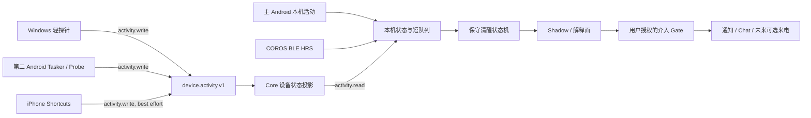
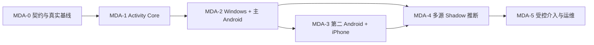

# 多端活动检测与保守睡眠守护路线图

> 状态：MDA-0 已接受带红灯收口；MDA-1 已完成自动 Gate、独立终审与 Lynx 真人 Gate；MDA-2 已进入限定本地实现，R3+M3、W3、A2与默认关闭的A3-I已选择性本地集成，真实部署/设备/真人 Gate 未开始
>
> 最后更新：2026-09-12
>
> 执行分支：`v3-lab`
>
> 上位路线：[`PRODUCT_ROADMAP.md`](PRODUCT_ROADMAP.md)
>
> 当前实现基线：已提交主线为 `bbb8025d`，iCore protocol `0.1` / schema `4`；MDA-1 隔离合并候选为 schema `5`，尚未部署。MDA-0 与 Gate 1A-0 已收口；COROS 精确 APK `3056968E…761D4` 已于 2026-09-10 通过零大缺口 8 小时 Gate，三星重启恢复、产品耗电预算与睡眠判断不在该结论内。

本文把 Windows、一台安装完整 Here I am 的主 Android、另一台不安装完整 Here I am 的 Android、无自研 App 的 iPhone，以及 COROS 标准心率广播，收拢成一条可分阶段验收的多端活动检测路线。

它回答五个问题：现有 Here I am 真正能复用什么；其他设备不安装完整 App 时如何上报；什么叫“设备在线”“发生交互”和“用户可能仍清醒”；怎样保护聊天、健康与使用隐私；何时才允许系统主动介入睡眠。

本文不自动授权代码实现、安装、创建 Goal、commit、push 或发布。2026-09-05，Lynx 明确批准 MDA-1 以隔离 worktree 和不重叠拥有路径继续；2026-09-06，Lynx 接受最终三 probe 合成报告与已披露边界，MDA-1 完成并停止。它不取代当前白板 P4，不接触其候选、进程、设备或真人 Gate。后续阶段仍需按 [`COLLABORATION_EXECUTION_PROTOCOL.md`](../development/COLLABORATION_EXECUTION_PROTOCOL.md) 单独确认，不能因 MDA-1 完成而自动进入 MDA-2、推断或主动介入。

---

## 1. 产品定位与完成定义

### 1.1 北极星

最终体验不是“监视所有设备”，而是：当夜间确有近期设备交互、身体信号仍不支持入睡、并且用户已授权当前介入窗口时，Here I am 能及时知道“你可能还醒着”，说明依据，并用不会继续刺激大脑的方式提供一次合适的帮助。

完整 Here I am 仍只安装在主 Android。其他设备只运行最小探针或系统自动化，发送设备活动事件，不同步聊天、Memory V3、User-truth、卡片、模型配置或 Here I am 数据库。

### 1.2 可日常使用的完成定义

只有以下条件全部满足，才可称为“多端活动检测可日常使用”：

- Windows、主 Android、第二 Android 和 iPhone 的真实支持范围分别可见，不把网络在线冒充用户正在操作；
- 每个事件都有设备、来源、信号发生时间、核心接收时间、置信度、有效期和故障状态；
- 探针沉默、权限被撤销、网络中断、系统杀后台或时钟异常时统一降级为 `unknown`，绝不自动写成“已睡”；
- 主 Android 在 Core 不可达时仍能使用本机心率与本机活动信号，但明确标记远端设备状态过期；
- 探针凭据只能写入活动域，不能读取聊天 change feed、Memory、卡片或其他设备事件；
- 原始 App 名、窗口标题、按键、屏幕内容和聊天正文默认不采集；跨端只传事件类别与必要时间；
- 用户能逐设备停用、撤销、查看最后上报、删除活动数据，并看见系统为什么得出当前状态；
- 至少完成一段无打扰 shadow 夜间基线，再逐级验收通知、对话或来电；自动测试不能替代真实夜晚与真实设备 Gate；
- 主动介入有单一执行者、冷却、去重、静默和失败 receipt，不会由手机、Core 与多个后台任务重复触发。

本路线输出的是生活辅助状态，不是医学诊断。睡眠分期、失眠诊断、呼吸暂停筛查和临床结论均不在本路线内。

---

## 2. 当前设备范围与约束

| 端 | 预期角色 | 完整 Here I am | 首版可获得的高价值信号 | 明确限制 |
|---|---|---:|---|---|
| 私人 Windows | iCore 当前权威节点 + 轻量活动探针 | 已有桌面代码表面，不要求常开 UI | 登录/锁定/解锁、最近键鼠输入距今、休眠/恢复、探针心跳 | Core 与被监控电脑同机；电脑关机时不能继续汇总其他设备 |
| 主 Android | 唯一完整 Companion、COROS 接收端、状态解释与干预终端 | 是 | Here I am 生命周期、屏幕/解锁事件、UsageStats/UsageEvents、BLE 心率、通知/来电交付状态 | Android/OEM 后台限制；现有 App 前台心跳只表示 Here I am 自身可见 |
| 第二 Android | 轻量探针 | 否 | 屏幕/解锁、指定应用类别、探针心跳 | Tasker 首版是 best-effort；可靠补传不足时才升级为旁路 APK |
| iPhone | 系统快捷指令探针 | 否；不依赖 Apple 开发者账号 | 睡眠 Focus、充电等用户手工配置并经真机验证的离散事件；App 开/关仅为待证实可选源 | 无通用亮屏/锁屏/解锁/持续前台 App 流；触发器能力依 iOS 版本而异，不能宣称完整实时检测 |
| COROS 光学心率臂带 | 身体实时信号 | 不适用 | 标准 HRS BPM、接触、可选 RR、连接质量与 gap | 心率不能单独判断睡眠；实际广播字段与整夜连续性仍待实物 Gate |

第一版不监控其余电脑、iPad 或墨水屏阅读器。扩设备必须先证明现有四端事件语义、凭据撤销与误判处理稳定，不能用“再加一个心跳”绕过范围 Gate。

---

## 3. 现有 Here I am 真实基线

| 能力 | 已有实现与证据 | 当前不能宣称 |
|---|---|---|
| iCore 设备与同步 | `devices` 已有安装 ID、平台、客户端版本、能力声明、哈希 token、ack cursor；聊天有幂等 ID、设备内序号和 change feed。[`i_core_store.mjs`](../../tools/i_core/i_core_store.mjs) / [`CORE_API_V0.md`](CORE_API_V0.md) | `capabilities_json` 目前只是登记，不是授权 scope；没有活动事件、心跳、撤销、保留、设备列表或 presence API；`updated_at_ms` 只是配对/ack 时间，不是在线状态 |
| iCore 运行面 | 服务默认只绑定 `127.0.0.1:47841`，通过 Tailscale Serve 暴露 HTTPS；已有 Windows 登录计划任务安装器。[`tools/i_core/README.md`](../../tools/i_core/README.md) | 当前只支持 pairing/chat/change feed/cursor ack。2026-08-29 本次只读探测确认 loopback health 可达、schema 4；计划任务状态在受限会话中因 Windows 拒绝访问而未能复核 |
| Android 设备身份 | 安装级 UUID 明确不随备份复制，Core token 使用安全存储。[`device_identity_service.dart`](../../lib/data/services/device_identity_service.dart) / [`core_sync_connection_store.dart`](../../lib/data/services/sync/core_sync_connection_store.dart) | 现有身份没有探针 scope、设备撤销、活动能力、最后上报或时钟健康；不能把完整 Core token 放进 Tasker/快捷指令 |
| Android 手机使用 | 已声明 Usage Access，生产 Companion 工具可按需查询时间窗内各 App 的累计前台时长与 `lastTimeUsed`。[`PhoneUsageChannelHandler.kt`](../../android/app/src/main/kotlin/com/memexlab/memex/channels/PhoneUsageChannelHandler.kt) / [`phone_usage_service.dart`](../../lib/data/services/phone_usage_service.dart) | 当前是拉取式聚合查询，不读取 `UsageEvents`，不持续采集、不落活动事件、不跨端上传，也不是用户可见实时状态 |
| App 前台心跳 | UI 可见时每 60 秒双写 SharedPreferences/KV，90 秒内用于让后台 check-in 保持安静。[`main.dart`](../../lib/main.dart) / [`checkin_service.dart`](../../lib/data/services/checkin_service.dart) | 只表示 Here I am App 当时在前台，不表示手机已解锁、用户正在操作或其他设备活跃 |
| 实时心率 | 独立 Android `connectedDevice` 前台服务已实现标准 HRS 扫描、订阅、解析、陈旧/重连、gap、本机 JSONL 14 日保留和 Health/设置状态面。[`BLE_HEART_RATE_GATEWAY.md`](../development/handoffs/BLE_HEART_RATE_GATEWAY.md) | 软件闭环不等于 COROS 已实测；不含睡眠判断、体动、厂商离线补传或自动来电。实物广播、RR、锁屏 8 小时、电量与恢复仍待验 |
| Health 历史数据 | `HealthService`/strategy 能处理部分平台健康数据、步数和睡眠聚合；睡眠日期按醒来日归属。[`health_strategies.dart`](../../lib/data/services/health_strategies.dart) | Android Health Connect 主路径已因商店政策移除，现有 Health 不是主 Android 的实时睡眠信号总线，不能替代 BLE 与活动事件 |
| 主动 Check-in | WorkManager、精确 AlarmManager 与 Android foreground task 已有后台触发、通知和 CallKit 来电路径；前台活跃会抑制部分主动触达。[`companion_foreground_task.dart`](../../lib/data/services/companion_foreground_task.dart) | 三种驱动没有活动 trigger receipt、跨设备去重或统一执行租约；FGS 还受麦克风授权和 Android 背景启动限制，不能直接挂上“仍清醒就打电话” |
| 哄睡状态 | Companion 有基于用户明确说“要睡/睡不着/醒了”的对话状态机。[`sleep_companion_state.dart`](../../lib/agent/companion_agent/sleep_companion_state.dart) | 它是聊天语义状态，不观察设备或生理状态，也明确禁止自行断言用户已经睡着 |
| 历史睡眠推送 | 旧高频催睡、无回复确认、睡前电话、锁机与罚款机制已在 2026-06-30 删除。[`DEVLOG.md`](../../DEVLOG.md) | 新路线不得借活动检测恢复 1–2 分钟轰炸、把无回复当睡着、惩罚或无上限来电 |

代码存在、自动测试通过或某次通知曾送达，都不等于跨端或整夜真人 Gate 已通过。

---

## 4. 目标架构与权威边界



### 4.1 三种权威分开

| 层 | 权威 | 内容 | 不得混入 |
|---|---|---|---|
| 设备原始信号 | 产生信号的设备 | 原始系统事件、本机 App 归类、BLE 样本、发送队列 | User-truth、关系记忆、聊天结论 |
| 跨端活动事实 | iCore `device.activity.v1` | 最小事件、接收时间、去重、设备状态投影、撤销与保留 | 原始屏幕内容、完整 App 清单、窗口标题、按键 |
| 当下清醒推断 | 主 Android 首版；未来可迁移到唯一 Core worker | 有时效的候选状态、置信度、原因、冲突与降级 | “已经睡着”事实、医学诊断、自动 Memory Card |

主 Android 首版承担解释与交付，是因为 BLE 心率、通知、CallKit 和当前 Check-in 都在手机侧。迁移到 Core worker 前，必须通过单一执行租约或等价 fencing，禁止手机与 Core 同时介入。

活动域仍受总路线 Gate 1A 的单权威与迁移 ADR 约束。MDA-1 只能在 Gate 1A-0 已把 activity event/projection/retention 的对象归属、Core 接受边界、outbox、epoch/fencing 与灾难恢复关系映射进权威模型后实施；若用户明确批准并行例外，也只允许先执行不改生产 schema 的 MDA-0。`device.activity.v1` 不把 iCore 提升为 Card、User-truth 或全局业务权威，也不绕开 Gate 1A-3 的 Core intent 与单写者契约。

### 4.2 中枢部署分两步

1. **管线 MVP**：复用当前 Windows iCore。Windows 开机且用户登录时，探针与 Core 同机运行；锁屏期间预期继续运行，但必须在 MDA-0/MDA-2 真人验证。当前计划任务不是无用户常驻服务；注销、睡眠和关机均视为 Core 不可达。它适合先验证身份、事件、Windows 交互和主 Android 消费。
2. **真实夜间可用 Gate**：若 Windows 会休眠或关机，必须在以下方案中选择一个，不能假装当前 Core 仍在线：
   - 夜间保持 Windows 插电、系统运行、显示器关闭；
   - 在 NAS/树莓派/软路由等私人常在线节点运行同一 Core/活动接收面；
   - 增加只负责短期加密排队的中继，再由 Windows Core 接管；中继不是第二数据权威；
   - 主 Android 只保留本机判断，远端全部显示过期。把 Android 做成长期入站中枢仅作为实验备选，必须单独验证 OEM 杀后台和 Tailscale/VPN 生命周期。

Tailscale 只解决私网可达与传输边界。peer connected/active、ping 成功或 Core health 正常，都只能写入 `network_present`，不能生成 `unlocked`、`interactive` 或“人还醒着”。

iPhone webhook 在 MDA-0 必须先选择可达拓扑：要么 iPhone 运行 Tailscale 并访问 tailnet 内 HTTPS ingress，要么使用具有 TLS、限流、请求体上限、重放防护和独立撤销能力的受保护公网/中继 ingress。后者只能短期转送加密活动事件，不能成为第二权威。真实 URL 可达、token 泄露后的撤销与重放拒绝未通过前，iPhone webhook 不进入 MVP；不能把 Windows loopback 地址直接写进 Shortcut 后宣称可用。

---

## 5. 事件、状态与推断语义

### 5.1 最小事件契约

首版事件建议固定为：

```json
{
  "schema_version": 1,
  "event_id": "uuid",
  "device_id": "win-private",
  "probe_id": "win-session-probe",
  "origin_sequence": 1842,
  "kind": "session.unlocked",
  "signal_at_ms": 1787982364000,
  "confidence": "high",
  "ttl_ms": 300000,
  "source": "windows_wts",
  "payload": {}
}
```

Core 必须另写 `received_at_ms`，不能信任客户端伪造。`event_id` 与 `(device_id, origin_sequence)` 双重唯一；网络超时用原 ID 重试。同一唯一键若对应不同 canonical payload/digest，必须返回不可变冲突，绝不 last-write-wins；批量写入首版采用全批事务原子成功或失败，不能静默部分接受。`signal_at_ms` 用于行为顺序，`received_at_ms` 用于链路新鲜度；未来时间、倒退或漂移不改写原值，而是标记 `clock_skew`。

每个 source capability 还必须声明 `coverage_mode`、当前 coverage 窗口、预计上报间隔与过期 SLO。只有系统 API/探针能够证明该窗口被连续观察时，才有资格产出“未发生交互”的负向证据；离散自动化和单纯 heartbeat 只能证明某次上报成功，不能反推出两个事件之间一直安静。

首版 `kind` 白名单：

- `probe.heartbeat`：探针仍可上报，不表示用户正在使用；
- `session.locked` / `session.unlocked`：Windows 或可证实的系统会话变化；
- `input.activity` / `input.idle_bucket`：只传交互发生或分桶后的 idle，不传键值；
- `screen.interactive` / `screen.non_interactive`：设备显示交互状态；
- `app.category_active`：只传 `chat/social/video/reading/work/other` 等本机归类；
- `focus.sleep_on` / `focus.sleep_off`：iPhone 等系统自动化的用户意图提示，不等于已经入睡；
- `power.charging` / `power.unplugged`：弱上下文；
- `network.present`：低置信可达性；
- `sensor.heart_rate_quality`：首版只传 `fresh/stale/gap/unavailable`、source age 与连接质量；名称不代表跨端可读取原始心率，逐搏数据继续留在主 Android；
- `probe.permission_changed` / `probe.error`：权限、系统限制和故障必须作为一等事件。

### 5.2 两层状态投影

每台设备先独立投影：

| 状态 | 含义 |
|---|---|
| `active` | 有未过期的高置信交互证据 |
| `quiet_observed` | 探针健康，且该 source 对整个观察窗有可验证的连续 coverage，同时没有交互；只表示这台设备安静 |
| `locked` | 收到仍有效的锁定证据；不代表人已睡 |
| `network_only` | 只有网络/heartbeat，没有人机交互证据 |
| `unknown` | 探针离线、事件过期、权限缺失、系统限制或数据冲突 |

人的候选状态只消费设备投影与本机身体信号：

| 状态 | 进入依据 | 禁止解释 |
|---|---|---|
| `awake_evidence` | 任一设备近期解锁、输入或高置信 App 交互 | 不说明焦虑程度或为什么没睡 |
| `activity_candidate` | 有较弱或持续活动，但不足以确认近期人为交互 | 不直接触发高强度介入 |
| `resting_candidate` | 已声明且当前 coverage 合格的关键源均有新鲜安静证据，心率/体动趋势符合个人静息基线 | 不等于睡着 |
| `sleep_candidate` | 经 shadow 校准后的多源连续证据，同时没有冲突活动 | 仍是有时效的候选，不对用户表述为“已睡”，不自动写 User-truth |
| `unknown` | 任何关键源过期、冲突或覆盖不足 | 不能用“没有消息”替代 |

正向交互证据应立即把状态拉回 `awake_evidence`。无 coverage 的 heartbeat、网络在线或离散自动化一律只能进入 `network_only`/`unknown`。负向证据只能逐步提高静息候选，不能单独确认睡眠；没有经 MDA-0 硬件 Gate 确认的第二身体或环境源时，不得产出 `sleep_candidate`，最多停留在 `resting_candidate`。阈值必须从 shadow 数据和用户纠正中校准，不在文档里先写死一个“低于多少 BPM 就睡着”的规则。

---

## 6. 安全、隐私与数据生命周期

### 6.1 探针凭据必须与完整客户端分权

当前 iCore 的任意有效设备 token 可以读取 `/changes`；因此 Tasker、Windows 探针或 iPhone 快捷指令绝不能复用主 Android token。

`device.activity.v1` 必须先建立可执行的 scope：

- `activity.write`：只能给绑定的 `device_id/probe_id` 写白名单事件；
- `activity.read_summary`：主 Android读取最小状态投影；
- `activity.admin`：仅 Core 所有者配对、撤销、删除和查看诊断；
- `chat.read/write`、Memory、Card 与 worker 权限默认均无；
- `capabilities_json` 必须从展示字段升级为服务端实际校验，不能相信客户端自报；
- 每个 probe token 可单独撤销并有 `revoked_at_ms`；重新配对不静默复活旧凭据。

`activity.admin` 是 MDA-1 新增的 server-side owner principal，不是当前已有能力，也不得由 `capabilities_json`、任一 device token 或 probe 自报推导出来。admin 认证材料与 probe token 分开存储和轮换；write/read probe 无法通过换 capability 字段升级为 admin。

iPhone Shortcut 和 Tasker 中的 token 按“可被设备主人查看的写入密钥”设计，泄露后的最大影响只能是伪造本设备活动事件；Core 仍要限流、绑定设备、检测异常时间与允许用户一键撤销。

### 6.2 默认最小化

- Windows 默认只采锁定/解锁、idle 分桶、休眠/恢复和 heartbeat；窗口标题与进程名关闭；
- Android App 名在设备端映射为类别后再上传；分类表由用户控制；
- iPhone 只为用户选定的少数类别建自动化，上传类别而非 App 名；
- 不记录按键、输入内容、通知正文、网页 URL、搜索词、屏幕截图、麦克风或相机；
- BLE 原始逐搏沿用主 Android 本机隔离和现有 14 日策略；跨端只暴露质量与经 Gate 允许的短时特征；
- 活动事件不进入 SharedLife、Memory V3、Dreaming、聊天或 Project Memory；用户若要保存某晚结论，必须走显式健康记录/Record Organizer 入口并保留来源。

### 6.3 保留与删除的推荐起点

MDA-0 真人选择已经固定：Core 原始活动事件、设备端失败队列、BLE raw 与最小诊断统一只保留 1 天；这是隐私保留上限，不是逐条 raw 的最低可读保证。实时 snapshot 只留当前 fresh 值；经过约束的机器摘要/结论可长期保留至用户删除，用户确认结论走独立 User-truth 生命周期。MDA-1 只实现活动 Core 的 1 天 raw/诊断保留，不生成长期夜间总结，也不改 BLE 当前 14 日实现差距。活动读取必须公开 retained watermark/最早可读 cursor；清理跨过旧 cursor 时返回明确的 `resync_required` 并从最小 snapshot 恢复，不能静默跳过，也不能把保留清理误报成设备离线。每个 probe 另有按 origin sequence 推进的 `retained_origin_floor`：任一 raw 按 Core receipt time 到期后，同事务退休 floor 及以下的完整前缀；该边界只产生 `event_retained_out`，不能替代 feed cursor 的 retained watermark。

删除一个 probe 时，撤销必须立即阻断后续访问；primary event、projection 与设备 spool 在删除任务完成时清除。加密备份按单独、公开的过期窗口淘汰，不能承诺即时物理抹除；诊断日志不得包含 token 或原始 payload。导出与删除验证必须能区分原始事件、设备投影、推断结果和用户确认记录，并覆盖 API、summary、export、spool 以及备份到期后的行为。

---

## 7. 各端实施路线

### 7.1 Windows 轻探针

首版只做用户态、登录自启、无界面或极窄诊断面：

- 用 Windows session notification 捕获登录、锁定、解锁和远程/本地 session 变化；
- 每 15–30 秒读取最后输入距今并上报分桶，不采键值；
- 捕获电源休眠/恢复和探针启动/停止；
- 仅在状态变化时发事件，并以低频 heartbeat 证明探针仍健康；
- Core 不可达时使用有界本机 spool，恢复后按原事件 ID/序号补传；
- token 使用 Windows 受保护存储，不写日志、命令行或仓库；
- 与 iCore 计划任务分别拥有进程和诊断，避免 Core 崩溃被误写成“电脑没人用”。

实现语言在 MDA-0 比较 PowerShell + Win32 P/Invoke、.NET 单文件或其他现有运行时；选择依据是自启、消息循环、签名/升级、资源占用和可测试性，而不是追求最少代码。官方能力依据：[WTS session notification](https://learn.microsoft.com/en-us/windows/win32/api/wtsapi32/nf-wtsapi32-wtsregistersessionnotification)、[GetLastInputInfo](https://learn.microsoft.com/en-us/windows/win32/api/winuser/nf-winuser-getlastinputinfo)。

### 7.2 主 Android

- 保留现有 `PhoneUsageQuery` 作为聊天按需工具；新增活动采集器时使用 `UsageStatsManager.queryEvents()` 补读遗漏窗口，而不是改坏现有聚合查询；
- 运行期动态监听屏幕 interactive 与用户解锁信号，静态 Manifest 不冒充可接收所有事件；
- 建立活动本地 outbox、设备状态快照和“检测就绪度”：Usage Access、通知、BLE、FGS、精确 alarm、Core、Tailscale/OEM 电池状态分别显示；
- 现有 App 前台 heartbeat 只作为 `hereiam.foreground`，不提升为整机 interaction；
- BLE 心率 gateway 只通过窄接口向推断层提供最新样本、趋势特征和质量/gap；服务本身不调用 AI 或 Check-in；
- Core 不可达时继续显示本机信号，远端设备转 `unknown`；恢复后拉取状态而非全量遥测历史；
- 用户可在设置中暂停检测、忘记设备、删除活动数据，并看到每个状态的证据来源。

Android 官方接口与限制：[UsageStatsManager](https://developer.android.com/reference/android/app/usage/UsageStatsManager)、[UsageEvents.Event](https://developer.android.com/reference/android/app/usage/UsageEvents.Event)、[Foreground services](https://developer.android.com/develop/background-work/services/fgs)。

### 7.3 第二 Android

首版优先 Tasker，不安装完整 Here I am，也不复制数据库：

- Profile 捕获屏幕、解锁、充电和用户选定的 App 类别；
- Task 只向 activity ingress POST 白名单 JSON；
- 使用独立 write-only probe token，并从省电限制中显式豁免 Tasker；
- 不建立聊天、Card、Memory 或 Core read 权限；
- Tasker 无可靠本地 outbox 时把丢失写成 `unknown`，不伪造连续状态。

若真人 Gate 证明 Tasker 在目标机型上长期延迟、缺失或配置易漂移，再做一个只含事件采集、加密凭据、有界队列和诊断的旁路 APK。Android 旁路 APK 可侧载，不需要 Google Play 开发者账号，但仍需用户逐项授权。

### 7.4 iPhone（无自研 App）

只承诺在当前 iOS 版本上、由用户手工配置并在 MDA-3 真机验证成功的离散信号。首选候选是：

- 睡眠 Focus 开/关；
- 接入/断开充电；
- 可选 Wi-Fi/蓝牙类自动化；
- 指定少数 App 的打开/关闭仅作为待证实源，不进入默认能力承诺；
- `Get Contents of URL` 向 write-only activity webhook POST。

任何 trigger 若在目标 iPhone/iOS 上不可配置、需额外确认或不能稳定执行，能力立即标为 `unsupported`/`unknown`，不得用其他自动化推测补齐。官方 Shortcuts 触发器没有通用屏幕亮灭、锁定/解锁或任意前台 App 持续使用流，所以 iPhone 不能承担“完整实时活动探针”。网络路径还必须按 4.2 在 Tailscale iOS 或受保护 ingress 中二选一；仅有 Tailscale peer 状态仍不是活动证据。若将来要求 Screen Time/DeviceActivity 级覆盖，必须单独评估自研 iOS App、Apple Developer 账号、Family Controls entitlement 和用户授权，当前路线不暗示可绕过。[Shortcuts automation triggers](https://support.apple.com/en-au/guide/shortcuts/apde31e9638b/ios)、[Get Contents of URL](https://support.apple.com/en-gb/guide/shortcuts/apd58d46713f/ios)、[Family Controls entitlement](https://developer.apple.com/documentation/FamilyControls/requesting-the-family-controls-entitlement)。

---

## 8. 固定执行路线



### MDA-0 — 契约、隐私与真实设备基线

**目标**：在写共享 schema 前，固定支持范围、事件字典、状态语义、部署拓扑、保留/删除和真实硬件证据。

**进入条件**：当前活动 Goal 已关闭/被明确取代，或用户明确授权 MDA-0 作为隔离的只读/设计 Goal；COROS BLE 软件候选与目标设备可用于真人检查。

**产物**：

- `device.activity.v1` ADR、事件/状态/权限词典和 threat model；
- 四端设备清单、每端允许信号、关闭方式和预期故障；
- Windows iCore 夜间是否保持运行的拓扑决定；
- iPhone 选择 Tailscale iOS 或受保护 ingress；未选择则把 iPhone webhook 明确移出 MVP；
- COROS 实物字段、锁屏连续性、gap、重启和电量基线；
- 不含私人正文的测试 fixture、故障矩阵与真人记录模板；
- 原始事件/心率/推断/用户确认记录的保留与删除决策。

**自动 Gate**：ADR lint/链接、协议 fixture 往返、非法 kind/字段/未来时间/超大 payload 拒绝样例；不迁移生产 schema。

**真人 Gate**：用户看见每台设备“能知道/不能知道什么”，确认默认不采窗口标题/App 原名；完成 COROS 短时与至少一轮锁屏长测；选择管线 MVP 与真实夜间中枢方案；在真实 iPhone 上验证所选 HTTPS URL 可达、泄露 token 可立即撤销、重复重放与错误凭据被拒绝，否则将 iPhone webhook 标为未支持。

**退出条件**：没有把 `network_present`、App 前台 heartbeat 或单一心率写成“用户清醒/睡着”；所有待实现字段和删除边界都有明确 owner。

### MDA-1 — `device.activity.v1` Core 控制面

**目标**：在不污染 chat change feed 的前提下建立活动专用 ingest、投影、凭据和撤销。

**进入条件**：MDA-0 真人 Gate 通过，用户确认 MDA-1 为当前 Goal；Gate 1A-0 已通过 ADR 明确活动 event/projection/retention 的对象归属、Core 接受边界、outbox、epoch/fencing 与灾难恢复关系。未满足时不得迁移生产 schema。

**必须实现**：

- activity probe 单独配对与服务端强制 scope；
- append-only activity events、双时间戳、双幂等键、乱序/补传/时钟漂移处理；
- 每设备状态投影、source coverage、TTL、`unknown`、故障/权限状态和最小 summary read；
- 单 probe 撤销、删除、限流、审计与保留清理；
- retained watermark、最早可读 cursor、`resync_required` 与最小 snapshot 恢复；
- schema migration、备份、回滚和旧 Core/旧客户端兼容；
- 健康端点公开 activity feature 版本，不把 schema 存在冒充端到端可用。

**自动 Gate**：重复提交、两种唯一键对应不同 canonical payload 的不可变冲突、批量原子失败、乱序、24 小时离线补传、未来/倒退时钟、过期 TTL、coverage 缺失、撤销后重放、跨 device 冒充、write token 读取 chat、probe token 伪装 admin、保留清理后的 cursor/snapshot resync、删除后的 API/summary/export/spool 与备份到期、迁移/回滚全部有测试；现有 iCore 全量回归保持绿。

**真人 Gate**：用三个测试 probe 分别配对、写入、查看状态、撤销；被撤销 token 不能再写且从未能读取聊天。Core 停机/恢复后不丢已接受事件，也不把停机窗口投影成 quiet/asleep。

**退出条件**：主 Android 可以只读查询一个带来源/新鲜度的设备 summary；Tasker/Shortcut token 泄露也不能读取 Here I am 私人数据。

### MDA-2 — Windows 与主 Android 高质量纵切

**目标**：先用信号质量最高的两端完成“真实交互 → Core → 主 Android 可解释状态”闭环，不做主动催睡。

**进入条件**：MDA-1 退出条件满足，`device.activity.v1`、source capability/coverage 与权限字典已锁定；验收主窗选择唯一 MDA-2 候选，Windows 与 Android worker 只按共享 fixture 实现。

**并行工作包**：

- Windows probe：session、idle、power、heartbeat、spool、自启、更新/卸载与诊断；
- 主 Android collector：UsageEvents/动态屏幕事件、本机 outbox、权限就绪度和 Core summary consumer；
- Health/设置最小解释面：设备、最后接收、最后交互、来源、TTL、故障、停用/撤销；
- BLE 质量接线：只暴露 fresh/stale/gap 与经 ADR 允许的局部特征，不做推断。

**自动 Gate**：MDA-0 先为每类 source 固定可测的延迟 SLO 与超时降级上限；Windows 锁/解锁、idle 边界、休眠/恢复、进程重启和 spool；Android 权限拒绝/撤销、screen/user-present 补读、Doze/force-stop/重启、Core 离线/恢复；所有缺口均降级为 `unknown`。Manifest、FGS type、flavor 包名和协议兼容有静态守门。

**真人 Gate**：

- Windows 至少完成锁定、解锁、持续阅读无输入、视频播放、休眠/恢复和网络中断场景；
- 主 Android 完成亮屏/解锁、指定 App 类别、锁屏、划掉任务、重启、Usage Access 撤销和 BLE 同时运行；
- 主 Android 页面能解释“电脑网络在线但没人交互”“Here I am 在前台”“心率陈旧”三者不同；
- 至少一晚只记录不干预，事件无明显重复、错序或整段伪连续。

**退出条件**：任一端的真实交互能在允许延迟内出现在主 Android；端不可达时不生成错误的 quiet 或 asleep。

### MDA-3 — 第二 Android 与 iPhone 轻量接入

**目标**：证明不安装完整 Here I am、不复制数据库，也能把低权限活动证据接入同一状态面。

**进入条件**：MDA-1 退出条件满足且 write-only probe token、撤销、限流与 ingress 已真人通过。若 MDA-2 尚未退出，只允许离线设计 Tasker/Shortcut 配置与 fixture，不得连接真实 Core 或把边缘端写成可用。

**第二 Android Gate**：先用 Tasker；验证 screen/unlock/充电/选定 App 类别、token 撤销、省电与网络失败。若关键事件在目标机型上无法稳定工作，再由同一 Goal 提交“是否升级旁路 APK”的变更请求，不能静默扩大。

**iPhone Gate**：用户手工选择少量当前系统实际提供的 Shortcuts 触发，首选逐一验证 Focus、充电与 webhook 失败；App 开/关只有在目标 iOS 真机无额外替代推断且稳定验收后才加入 capability。同时验证所选 Tailscale iOS/受保护 ingress、撤销与重放保护。UI 必须持续显示“离散自动化，非完整实时监控”，没有连续 coverage 时为 `unknown`。

**自动 Gate**：activity ingress 对最小客户端 JSON、重复事件、错误 token、缺失字段和速率限制有协议测试；主 Android 可显示不同 probe 的能力声明与最后错误。

**真人 Gate**：两端均完成停用/恢复/撤销；iPhone 任意一个未配置 trigger 不拖低其他设备的可信状态，也不被系统推断为“iPhone 没在用”。

**退出条件**：四端状态可同时出现，且每端的能力和缺口与事实一致。网络 presence 仍只是低置信辅助。

### MDA-4 — 多源保守推断与 Shadow 夜间基线

**目标**：先只计算、解释和评估，不发送通知、不写聊天、不来电。

**进入条件**：MDA-2 与 MDA-3 真人数据可用；或者用户明确批准将首个 shadow 范围降级为“Windows + 主 Android”，并在 UI/报告中排除未接入端。所有关键 source 的 coverage、SLO 和失效语义已经锁定。

**推断输入**：设备活动投影、探针健康、时间窗、BLE 心率新鲜度/趋势、可选体动、用户配置的最早介入窗口和当晚例外。不得用模型自由阅读原始事件后随意下结论；首版是可测试的确定性状态机，AI 只负责把已有理由用自然语言解释。

**必须覆盖的反例**：

- 手机安静但 Windows 正在输入；
- Windows 播放视频或阅读很久没有输入；
- 设备都在线但都未解锁；
- 低心率但人醒着、运动后高心率但准备休息；
- 有声小说/音频持续播放但人可能已睡；
- iPhone Shortcut 漏触发、Android 被杀、Windows 时钟漂移；
- 用户主动说睡不着、主动说已醒、当晚工作或其他例外；
- 新事件在 `sleep_candidate` 后出现，状态立即回到 `awake_evidence`。

**自动 Gate**：固定 synthetic timeline 覆盖缺失、冲突、延迟、乱序、单源假阳性和状态恢复；任何关键源过期都不能提高睡眠置信；状态理由与输入事件可逐项追溯。

**真人 Gate**：至少 7 个真实夜间/清晨样本，包含正常入睡、明显晚睡、至少两类设备切换，以及至少一晚关键源失效或整夜断网；用户只标注“当时醒着/可能睡着/不确定”和误判原因。标注只作评测事实，不自动进入 User-truth。

**退出条件**：对“近期仍清醒”的召回率足以支持提醒试点，同时假阳性和不可解释状态达到用户可接受；未通过则继续 shadow 或收窄输入，不进入干预。

### MDA-5 — 受控介入、交付可靠性与日常运维

**目标**：在 shadow 证据通过后，把状态接入现有 Companion/Check-in，但采用逐级、可停、低刺激的交付。

**进入条件**：MDA-4 shadow 自动/真人 Gate 均通过，用户明确确认允许试验的干预层级、时间窗、次数、静默与停用规则。`voice_call` 即使列在本阶段，也必须在通知/Chat 真人通过后再次单独授权。

**固定升级顺序**：

1. `shadow`：只记决策与理由；
2. `local_nudge`：一次安静、可关闭的本机通知；
3. `companion_checkin`：用户点开或明确允许后，用短对话疏解当前阻塞；
4. `voice_call`：只有前三层真人通过、用户再次明确授权时间窗/次数/静默规则后，才作为本阶段的独立子 Gate；默认关闭。

**硬约束**：

- 每晚/每窗口最大次数由用户设置，默认一次；
- 用户不回复不等于睡着，也不触发不断升级；
- 新的高置信交互可以重新评估，但仍受冷却和总次数限制；
- App 正在对话、通话、播放哄睡内容或用户设为“今晚不打扰”时抑制介入；
- 通知、Chat 与来电共用一个 intervention ID、owner、receipt 和 dedupe；
- 不联动罚款、强制锁机、色情/羞耻惩罚或默认设备控制；现有 App Blocker 不在本路线自动调用；
- LLM 失败、CallKit 失败、通知权限拒绝和 Core 不可达均只记录失败，不声称已经联系。

**探索性真机证据（2026-08-29，不改变进入条件）**：三星 `SM-S9110` 上的消费版 ChatGPT `1.2026.223` 已验证一条无需 Realtime API 的桥接：Android `ACTION_SEND text/plain` 动态预填当晚指令，自动发送后让 ChatGPT 只生成一条开场白，调用该回复的“朗读”，播放结束后再进入同一会话 Voice。用户确认能先听到开场白并自然接话。反向证据同样明确：`chatgpt://voice` 只打开普通聊天首页；直接进入 Voice 不会主动说第一句。该链路目前依赖未公开承诺的消费版 UI 与控件位置，只能作为 MDA-5 的候选交付实验；正式采用前必须用可校验控件定位替代裸坐标，并覆盖 App 版本/语言/键盘/锁屏变化、朗读完成检测、Voice 麦克风 running、超时、失败 receipt 和立即停用。开场白内容另走低刺激真人调参，不把一次“听到了”扩大成时机或睡眠帮助已通过。

**自动 Gate**：并发 trigger、重试、跨 isolate、App 前台、Core worker lease/fencing、通知/Chat/CallKit receipt、冷却、每日上限、关闭开关和撤销全部有测试；历史 Sleep Push 关键模式有负面回归断言。

**真人 Gate**：先完成至少 3 次通知级试点，确认时机、措辞和刺激程度；再决定是否开放 Chat。来电必须单独验收，并能立即关闭。用户评价同时记录“是否有帮助”“是否更清醒/被打扰”“是否误判”和“是否想保留”。

**退出条件**：连续日常使用中没有重复触达、错误升级或静默失败；设备与 Core 重启后状态和开关一致；用户能随时暂停、撤销 probe、删除活动数据并恢复到纯本机心率模式。

---

## 9. 统一故障与真人验收矩阵

| 场景 | 正确状态 | 禁止行为 |
|---|---|---|
| Tailscale 可达、没有交互事件 | `network_only` | 标成 active/awake |
| heartbeat 过期 | `unknown` | 标成 quiet/asleep |
| Windows 锁定后电脑仍有网络流量 | `locked` + network | 因网络流量推断人在操作 |
| 手机 Usage Access 被撤销 | source unavailable/unknown | 沿用旧 lastUsed 当实时证据 |
| iPhone Shortcut 没触发 | iPhone unknown | 当成 iPhone 没被使用 |
| Core 离线但主 Android BLE 正常 | local-only degraded | 假装其他设备仍新鲜 |
| BLE 陈旧或断连 | sensor gap | 用最后 BPM 延续趋势 |
| 事件补传晚到 | 按 signal time 解释、received time 判新鲜 | 把旧交互当“刚刚发生” |
| 解锁/输入与静息心率冲突 | `awake_evidence` | 让心率覆盖正向交互 |
| 所有设备安静但关键探针失效 | `unknown` | 直接生成 sleep_candidate |
| sleep_candidate 后收到交互 | 立即转 awake evidence | 等固定窗口结束才更新 |
| 用户说今晚不打扰 | inference 可继续，delivery off | 仍通知/来电 |
| 用户未回复一次提醒 | unknown/保持当前证据 | 视为睡着或连续追打 |

每个阶段都要分别记录：协议自动测试、模拟时间线、设备真机、整夜连续性、隐私/删除、主动交付。任何一栏红灯都不能汇总成“系统已经能实时判断睡眠”。

---

## 10. 串行、并行与共享契约停点

- MDA-0 必须先完成；MDA-1 是共享 Core schema/认证契约，只能由一个集成工作流修改并迁移。
- MDA-1 稳定后，Windows probe 与主 Android collector 可以在隔离 Worktree 并行；协议 fixture 和 capability 字典由 MDA-1 持有，worker 不得各自扩字段。
- 第二 Android Tasker 配置与 iPhone Shortcuts 设计可并行，但必须等 write-only probe token 可用后才连接真实 Core。
- BLE HRS 服务、Android activity collector 与 Companion foreground task 是三个不同生命周期；不得为省事合并成一个 FGS 或让某个服务 stop 时连带杀死其他服务。
- 全局 iCore migration、Flutter/Android build、真实设备安装、Tailscale Serve 调整、计划任务变更和唯一真人候选必须串行。
- 任何 App/窗口名称上传、保留期延长、iOS 原生开发、常在线云中继或自动来电都属于共享契约/隐私变更，必须停下等用户确认。

---

## 11. 已知风险、后置事项与推荐默认

### 11.1 主要风险

- **同机中枢悖论**：Windows iCore 无法在自己关机时继续接收，必须在真实夜间 Gate 前选择常在线方案或接受远端 unknown。
- **Android 后台不确定性**：FGS、Usage Access、Alarm、通知和 OEM 省电都可能独立失败，必须显示 readiness 而不是用一个总开关掩盖。
- **iPhone 覆盖天花板**：Shortcuts 只能提供离散、自愿配置的证据；没有开发者账号时不存在可靠的通用实时解锁监控。
- **低交互不等于睡眠**：长视频、阅读、听小说、躺着思考和设备放置都会制造假安静；心率也可能因情绪、运动、饮酒、药物或设备接触变化而偏离。
- **主动介入可能反向提神**：通知、Chat 和来电本身都可能增加刺激，所以 usefulness 和 sleep disruption 必须同时作为真人 Gate。
- **活动遥测高度敏感**：即使没有内容，时间模式也能暴露生活节律；scope、保留、删除和本地归类必须先于功能便利。

### 11.2 明确后置

- 睡眠分期、医学诊断、呼吸暂停或精神健康判断；
- 原始 PPG、全夜 ECG、体温或未经硬件证实的 RR/体动能力；
- iOS 自研 App、Family Controls/DeviceActivity、MDM；
- 全量 App/窗口历史、屏幕截图、通知内容、键盘记录；
- 自动锁机、罚款、支付、设备控制或无上限电话；
- 将活动推断自动写入 Memory V3/User-truth；
- 公共互联网裸暴露、把 Tailscale 当唯一认证或把 probe token 写入仓库。

### 11.3 当前推荐默认

- 管线 MVP 先复用 Windows iCore；真实夜间 Pilot 前明确电脑是否保持运行；
- Windows 不采窗口标题/进程名；Android/iPhone 只上传本机分类后的类别；
- 第二 Android 先 Tasker，可靠性不足才做旁路 APK；
- iPhone 先验证 Sleep Focus、充电与真实 webhook 可达；App 类别仅在目标 iOS 触发器真机通过后加入，不追求伪完整覆盖；
- 原始活动事件、设备 spool、BLE raw 与最小诊断的产品目标统一保留 1 天；MDA-1 只落 Core 活动域，BLE 14 日现状作为后续实现差距保留；长期趋势默认关闭；
- 先 Windows + 主 Android，再接低质量边缘端；
- 至少 7 个 shadow 夜间样本后才开放一次通知；Chat 与来电继续分级；
- 自动来电默认关闭，不把“外力机制”直接实现成高频催促。

---

## 12. 当前阶段 Goal

MDA-0 已由 Lynx 接受以已记录的 COROS 严格连续性、iPhone activity ingress 与 Windows suspend/resume 红灯收口；它固定的是证据与隐私契约，不是活动接收实现。

2026-09-05，Lynx 明确要求隔离继续，当前活动域 Goal 为：

> **MDA-1 — `device.activity.v1` Core 控制面：实现活动专用 ingest、服务端强制 scope、append-only 事件、设备投影、coverage/TTL/unknown、撤销/删除/1 天保留、cursor/resync 与主 Android 最小只读 summary；不实现采集端、推断或主动触达。**

状态页：[`GOAL-20260905-mda1-device-activity-core-control-plane.md`](../development/goals/GOAL-20260905-mda1-device-activity-core-control-plane.md)。这是经用户批准的隔离并行例外，不取代 P4，也不自动创建 MDA-2～MDA-5。

2026-09-06 状态：MDA-1 的 Core、fixture/真实 loopback runner、主 Android 最小只读 reader 与三 probe 合成审看 harness 已在隔离分支完成自动验证和 fixed-candidate 审计，当前无未关闭 P0/P1；Lynx 已明确接受三 probe 报告、三项非阻断 P2 与 whole-Core 只读备份边界，真人 Gate PASS，MDA-1 完成。MDA-2 未启动；该候选没有接入真实 Windows/Android/iPhone collector，也不提供睡眠推断或主动触达，下一阶段必须另行授权。

---

## 13. 依据与相关文档

项目内权威：

- 总产品与优先级：[`PRODUCT_ROADMAP.md`](PRODUCT_ROADMAP.md)
- 协作生命周期：[`COLLABORATION_EXECUTION_PROTOCOL.md`](../development/COLLABORATION_EXECUTION_PROTOCOL.md)
- Core API：[`CORE_API_V0.md`](CORE_API_V0.md)
- Core 数据域：[`CORE_SYNC_DATA_INVENTORY.md`](CORE_SYNC_DATA_INVENTORY.md)
- 旧跨设备路线：[`CROSS_DEVICE_I_WHITEBOARD_MVP_ROADMAP.md`](CROSS_DEVICE_I_WHITEBOARD_MVP_ROADMAP.md)
- BLE 软件交付与真实硬件 Gate：[`GOAL-20260829-ble-heart-rate-gateway.md`](../development/goals/GOAL-20260829-ble-heart-rate-gateway.md)
- 当前项目态：[`I_PROJECT_STATE.md`](../development/I_PROJECT_STATE.md)
- 历史决策：[`DEVLOG.md`](../../DEVLOG.md)

平台边界：

- Android：[UsageStatsManager](https://developer.android.com/reference/android/app/usage/UsageStatsManager)、[UsageEvents.Event](https://developer.android.com/reference/android/app/usage/UsageEvents.Event)、[Foreground services](https://developer.android.com/develop/background-work/services/fgs)
- Windows：[WTSRegisterSessionNotification](https://learn.microsoft.com/en-us/windows/win32/api/wtsapi32/nf-wtsapi32-wtsregistersessionnotification)、[GetLastInputInfo](https://learn.microsoft.com/en-us/windows/win32/api/winuser/nf-winuser-getlastinputinfo)
- iPhone：[Shortcuts triggers](https://support.apple.com/en-au/guide/shortcuts/apde31e9638b/ios)、[HTTP action](https://support.apple.com/en-gb/guide/shortcuts/apd58d46713f/ios)、[Family Controls entitlement](https://developer.apple.com/documentation/FamilyControls/requesting-the-family-controls-entitlement)
- Tailscale：[CLI/status semantics](https://tailscale.com/kb/1080/cli)

平台文档用于约束真实支持范围，不代表当前仓库已经实现这些 API，也不把某个平台“理论可用”写成目标设备已真人通过。
