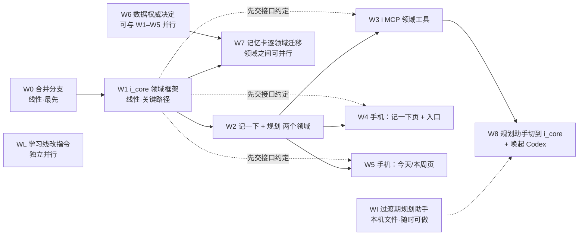

# 个人数据中枢：总规划与分窗口任务单（2026-10-05）

**用户已确认的原则（2026-10-05）**：i_core 是个人数据唯一的仓库；思源只管成篇的文字；各个 App 是看数据的窗户，各个 Agent 是干活的，两者都不各自存一份数据。

本文给 Codex 分窗口执行用。每个窗口开工前先读本文的第 1～4 节，再读自己的任务卡（第 5 节）。

---

## 1. 原则

1. **一个仓库。** 结构化的个人数据都进 i_core，一个 SQLite 库，按领域分表。领域包括聊天、记一下、规划、收支、经期、睡眠摘要、招聘批次，以后还有学习账本。
2. **文字归思源。** 笔记、学习资料、复盘长文、教学设计留在思源。思源里出现的结构化数据，要么是从 i_core 单向生成的只读副本，要么由插件直接读 i_core 显示。**不做双向同步。**
3. **窗户不存数据。** Here I Am（手机）、思源（电脑）、FlexNote 都只是视图。在窗户里做的修改，要通过 i_core 的接口写回去，不在窗户里另存一份。
4. **Agent 走同一个接口。** 林埃的 worker、Codex、Claude 网页端都通过 i_core 的 API 读写，或通过包装这些 API 的 MCP（现在的 i 工具）读写。dot 只能读写文件，由 Codex 替它转一道。
5. **按领域授权。** 数据放在同一个库里，不等于谁都能看。每个令牌只授予它需要的领域。例如规划助手（Codex）拿不到私密聊天，读写权限也分开给。
6. **一步一步搬。** 新领域直接建在 i_core 里。已经在手机 Memory V3 里的数据，按领域逐个迁移，每个领域单独立项。迁移前先完成数据权威决定（见 W6）。
7. **原有边界不变。** 普通聊天不会自动变成 User-truth；Project Memory 和生活事实隔离；真实数据、令牌、私人内容不进 GitHub。这些都按 `AGENTS.md`。

## 2. 现状

| 数据 | 现在在哪 | 以谁为准 |
|---|---|---|
| 聊天记录 | i_core `chat_messages` | i_core |
| 手机活动（MDA） | i_core activity 域（默认关闭） | i_core |
| 收支、待办、睡眠、计划等记忆卡 | 手机 Memory V3（Drift） | 手机。电脑上只有 `tools/i_memory` 用 ADB 导出的只读快照 |
| "帮我记一下"的记录 | `tools/i_remote_mcp/.state/writeback.sqlite`，手机再拉取成记忆卡 | 先在 i_remote_mcp，再到手机 |
| 学习账本、招聘日历 | 思源数据库 | 思源 |
| 规划 | 方案写好了，**没建**（原计划放思源，现已作废） | 无 |
| 教招档案 | `D:\教师招聘备考系统` | 只读档案 |
| 健康 | COROS 手表 | COROS |

i_core 现在能做的：设备配对和令牌、聊天消息的幂等提交、按顺序的 change feed、每台设备的游标、worker 租约、activity 控制面。schema 是 5。它**还没有**领域表的通用做法，也没有按领域授权的令牌范围。

**分支**：下面这些都还没合进 `v3-lab`，有的已经在线上运行：
- `claude/b1-i-memory`、`claude/b2-remote-mcp`、`codex/continuity-*`：都已包含在 `claude/wonderful-carson-a26i9d` 里；
- `claude/b3-writeback`：比上面多两个提交，就是现在在用的两段式 `i_chat_turn`；
- `claude/wonderful-carson-a26i9d`：学习导师、教招规划；
- `claude/festive-ride-88vh1t`：规划助手、统筹、快速捕获设计、本文。

## 3. 目标形态

```
窗户：  Here I Am 手机（聊天 · 记一下 · 今天/本周）   思源（文章 · 只读看板）   FlexNote（画图）
           │                                          │
Agent：  林埃 worker   Codex（规划、学习）   Claude 网页端   dot（经文件）
           │  都只通过 i_core API / i MCP，令牌按领域授权
仓库：  i_core ── chat │ captures │ plan │ ledger │ cycle │ sleep │ … （同一个库，不同的表）
```

| 领域 | 表（暂定） | 谁写 | 谁读 | 哪个阶段 |
|---|---|---|---|---|
| 聊天 | 已有 | 手机、网页端、林埃 worker | 同左 | 已有 |
| 记一下 | `captures` | 手机、网页端（i_remember）、dot（经 Codex） | 规划助手 | W2 |
| 规划 | `plan_items`、`plan_weeks` | 规划助手 | 手机今日页、看板、网页端 | W2 |
| "帮我记一下"的记录 | 并入 `captures`，或单独设 `notes` | 网页端 | 手机、林埃 | W7 |
| 收支 | `ledger_entries` | 手机、林埃 worker | 看板、网页端 | W7（迁移） |
| 经期 | `cycle_entries` | 手机 | 林埃、看板 | W7（迁移） |
| 睡眠摘要 | `sleep_days` | COROS 导入 | 规划助手、林埃、看板 | W7 |
| 学习账本、招聘批次 | 待定 | 学习导师 | 规划助手 | W7 之后再评估，现在留在思源 |

## 4. 依赖关系：哪些必须先做，哪些可以同时做



**线性（必须按顺序做）**
1. **W0 合并分支**：所有窗口都要从同一个基线开工。
2. **W1 i_core 领域框架**：关键路径。它的**第一个产出是一份接口约定**（表的写法、令牌范围、各领域的 change feed、API 形状）。约定一定稿，W3、W4、W5 就可以先用假服务开工。
3. **W2 → W8**：规划助手要等 i_core 里真的有规划表、MCP 真的有规划工具，才能切过去。

**可以并行**
- W1 的接口约定定稿后，**W3、W4、W5 三个窗口同时做**：各自用假服务或测试夹具开发，W2 完成后再接真的。
- **WI 过渡期规划助手**：现在就能做，不依赖任何人。
- **W6 数据权威决定**：只写文档、做决定，可以和 W1～W5 同时进行。
- **WL 学习线**：按教招规划第 11 节改学习导师指令，和本文完全独立。
- **W7 各领域迁移**：要等 W1 和 W6 完成。之后收支、经期、睡眠等各领域之间可以并行，每个领域一个窗口。

**需要你本人做或明确授权的节点**
- 合入 `v3-lab`（W0，以及以后每个窗口的合并）。
- 在你电脑上升级正在运行的 i_core：停服务、备份、升级 schema（W2 上线时，W7 每次迁移时）。
- 把新版 App 装到你的主力手机上（W4、W5）。
- W6 的权威决定。

---

## 5. 任务卡

每张卡的格式：目标 / 依赖 / 产出 / 不做 / 验证 / 开场提示词。分支统一用 `codex/<卡号>-<短名>`，从 W0 之后的 `v3-lab` 开出。每个窗口完成后在 `DEVLOG.md` 顶部记一条，并在本文对应卡片标题后写"✅ 完成，分支/PR"。

### W0 合并分支（线性，最先）

- **目标**：把第 2 节列出的分支整理进 `v3-lab`，让后面的窗口有同一个基线。
- **依赖**：无。
- **产出**：一个整合分支和 PR。合并顺序：`claude/wonderful-carson-a26i9d` → `claude/b3-writeback` → `claude/festive-ride-88vh1t`。有冲突就逐个解决，CI 全绿。
- **不做**：不改任何功能；不 rebase、不 force-push（按 `AGENTS.md`）。
- **验证**：CI 全绿；`node --test tools/i_core tools/i_memory tools/i_remote_mcp` 全过；线上 i_remote_mcp 实际运行的提交，和合并后的代码一致（对比运行目录的 HEAD）。
- **开场提示词**：
  ```text
  读 docs/development/PERSONAL_DATA_HUB_PLAN_20261005.md 的第 2 节和 W0 卡。
  从 origin/v3-lab 开 codex/w0-integrate，依次合并 claude/wonderful-carson-a26i9d、
  claude/b3-writeback、claude/festive-ride-88vh1t（用 merge，不 rebase）。
  解决冲突，跑 node 测试和 CI，开 PR。合入 v3-lab 之前先问我。
  另外告诉我：我电脑上运行 i_remote_mcp 的目录现在在哪个提交，和合并结果有没有差别。
  ```

### W1 i_core 领域框架（线性，关键路径）

- **目标**：让 i_core 能按统一的方式加领域表，并支持按领域授权。
- **依赖**：W0。
- **产出**：
  1. **先交接口约定**，写成 `docs/development/I_CORE_DOMAIN_CONTRACT.md`：
     - 领域表的通用字段：`id`（客户端 UUID，用来去重）、`created_at`、`updated_at`、`deleted_at`（软删除）、`revision`、`source`（哪个设备或 Agent 写的）；
     - 每个领域单独的 change feed 和游标，不混进聊天 feed；
     - 令牌的领域范围：`domain:<名>:read`、`domain:<名>:write`；
     - 新领域的迁移写法（schema 版本、迁移前自动备份、回滚说明）；
     - API 形状：`GET/POST /v1/core/domains/<名>/...`。

     约定写好先给用户看，确认后立即在本文 W1 标题后写"约定已定稿"，W3、W4、W5 就可以开工。
  2. 实现：迁移框架（schema 5 → 6，只加表）、令牌范围模型（现有设备令牌默认只有聊天权限，行为不变）、通用的领域 feed，再加一个最小的示例领域和完整测试。
- **不做**：不建具体业务领域（那是 W2）；不动聊天和 activity 现有行为。
- **验证**：`node --test tools/i_core` 全过；从真实的 schema 5 库副本迁移成功（只用本机副本，结论不含数据）；旧设备令牌访问新领域被拒。
- **开场提示词**：
  ```text
  读 PERSONAL_DATA_HUB_PLAN_20261005.md 第 1～4 节和 W1 卡，以及 tools/i_core/README.md、
  i_core_store.mjs、i_core_server.mjs。先只写 docs/development/I_CORE_DOMAIN_CONTRACT.md，
  写完给我看，不要先写代码。我确认后再实现迁移框架、令牌范围和通用领域 feed。
  ```

### W2 记一下 + 规划两个领域（线性，依赖 W1）

- **目标**：在 i_core 里建 `captures` 和 `plan_items`（加上 `plan_weeks`，存每周配额和容量）。
- **依赖**：W1。
- **产出**：表和 API 都按领域约定来。字段从这两份文档搬过来：
  - `captures`：按 `docs/development/QUICK_CAPTURE_DESIGN_20261005.md` 第 5 节；
  - `plan_items`：按 `tools/life_planner/PLANNER_AGENTS.md` 的"规划库字段"，去掉思源专用的部分。上级、前置、替代为都用 id 引用。

  再加一个本机脚本，把过渡期规划助手的本机文件（见 WI）导入 i_core。
- **不做**：不做 UI，不做 MCP。
- **验证**：node 测试覆盖重复提交、软删除、领域权限、feed 游标，以及导入脚本的重复运行。
- **开场提示词**：
  ```text
  读 PERSONAL_DATA_HUB_PLAN_20261005.md、I_CORE_DOMAIN_CONTRACT.md、QUICK_CAPTURE_DESIGN_20261005.md
  第 5 节、tools/life_planner/PLANNER_AGENTS.md 的规划库字段。按 W2 卡在 i_core 加 captures、
  plan_items、plan_weeks 三个领域和 WI 文件的导入脚本，写测试。上线到我电脑的步骤单独列出来，先不要执行。
  ```

### W3 i MCP 领域工具（W1 约定定稿后可开工，W2 完成后接真的）

- **目标**：Agent 用同一套工具读写规划和记一下。
- **产出**：在 `tools/i_remote_mcp` 加以下工具，按令牌范围开放：
  - `capture_add`、`capture_list`、`capture_ack`；
  - `plan_list`、`plan_upsert`、`plan_set_status`；
  - `week_get`、`week_set`。

  另外：
  - 提供一个**只在本机监听**的入口给 Codex 用，不带聊天读取权限；
  - claude.ai 网页端可以用 `capture_add`，也就是把"帮我记一下"写进 i_core。是否同时停用旧的 notes 账本，留到 W7。
- **不做**：不改现有 `i_chat_turn`、`i_context`、`i_recall` 的行为。
- **验证**：node 测试，包括权限测试（规划令牌读不到聊天）；用假的 core 跑端到端测试。
- **开场提示词**：
  ```text
  读 PERSONAL_DATA_HUB_PLAN_20261005.md、I_CORE_DOMAIN_CONTRACT.md 和 tools/i_remote_mcp/README.md。
  按 W3 卡加领域工具和给 Codex 的本机入口，先用假 core 开发和测试；W2 合入后再接真的。
  ```

### W4 手机：记一下页和入口（W1 约定定稿后可开工）

- **目标**：侧键双击两秒内开始说话，说完就发到 i_core。
- **产出**：按 `QUICK_CAPTURE_DESIGN_20261005.md` 第 3、4 节实现：
  - 入口：launcher alias"记一下"、图标长按改指向新页、下拉快捷开关；
  - 捕获页：本机流式识别、可以编辑、本地待发送队列、断网补发。
- **不做**：不复用旧的 `MemexRouter.submitInput`；不进聊天时间线；侧键长按设为数字助理先不做。
- **验证**：Flutter widget 测试，CI 的 Windows 构建；真机验证侧键双击能不能选到"记一下"、冷启动要多久（L3，需要用户的三星手机）。
- **开场提示词**：
  ```text
  读 PERSONAL_DATA_HUB_PLAN_20261005.md、QUICK_CAPTURE_DESIGN_20261005.md、I_CORE_DOMAIN_CONTRACT.md
  和 AGENTS.md。按 W4 卡在 App 里做记一下页和入口，先接一个假的 captures 接口；W2 合入后改接真的。
  真机安装前先问我。
  ```

### W5 手机：今天 / 本周页（W1 约定定稿后可开工）

- **目标**：在手机上看今天的队列和本周进度，可以点"完成"。
- **产出**：
  - 读 `plan_items` 和 `plan_weeks` 的领域 feed；
  - 今天的队列，本周各主线进度条；
  - 点"完成"或"不做了"写回 i_core（需要 `plan` 的写权限，只开放这两种状态改动）。
- **不做**：手机上不做排程，排程是 Codex 的事。
- **验证**：widget 测试；用假 feed 演示今日单被重排后，页面自动更新。
- **开场提示词**：
  ```text
  读 PERSONAL_DATA_HUB_PLAN_20261005.md、I_CORE_DOMAIN_CONTRACT.md 和 tools/life_planner/PLANNER_AGENTS.md
  的今日单格式。按 W5 卡做手机的今天/本周页，先用假 feed。
  ```

### W8 规划助手切到 i_core（依赖 W2、W3）

- **目标**：规划助手不再用思源数据库或本机文件，改用 i MCP 的规划工具；有新的"记一下"时自动唤起 Codex。
- **产出**：
  - 改写 `tools/life_planner/`：存储部分换成 MCP 工具，分诊、配额、队列、事件驱动这些规则不变；
  - `capture_sync.mjs` 简化成一个监视器：订阅 i_core 的 captures feed，有新内容时按 `QUICK_CAPTURE_DESIGN` 第 6 节的合批、限频、静默时段唤起 `codex exec`；
  - 今日单除了写 `today.md`，同时写回 `plan_items`，让手机能看到。
- **验证**：用假的 codex 测监视器；在真实环境跑一天。
- **开场提示词**：
  ```text
  读 PERSONAL_DATA_HUB_PLAN_20261005.md 和 W8 卡，以及 tools/life_planner/ 全部文件。
  把规划助手的存储改成 i MCP 规划工具，写监视器，迁移过渡期的本机文件（用 W2 的导入脚本）。
  ```

### WI 过渡期规划助手（随时可做，和其他窗口都不冲突）

- **目标**：基础设施做好之前，规划系统先能用起来。
- **产出**：规划助手改用本机文件存储，不建思源规划库：
  - `%USERPROFILE%\life-plan\plan.json`：存事项，字段和"规划库字段"一致；
  - `week.md`：本周配额和容量；
  - `today.md`：今日单。

  捕获先用两种方式：dot 通话里说"记一下"，或者在电脑上直接对 Codex 说。手机一键捕获等 W4。
- **验证**：按 `tools/life_planner/README.md` 装好，跑一次"出今日单"。
- **开场提示词**：
  ```text
  读 PERSONAL_DATA_HUB_PLAN_20261005.md 的 WI 卡和 tools/life_planner/ 全部文件。
  按 WI 改成本机文件存储（plan.json），不建思源规划库，然后帮我装好并出第一份今日单。
  ```

### W6 数据权威决定（只写文档，可以并行）

- **目标**：决定手机 Memory V3 里的生活数据，以后以 i_core 为准的规则和顺序。
- **依赖**：无，可以和 W1～W5 同时做。
- **产出**：在 `docs/development/data-authority-preflight/` 的 A1 文档基础上，写一份正式决定：
  - 哪些卡片类型迁到 i_core 的哪个领域；
  - 迁移期间手机怎么写（直接写 i_core，还是先写本地再同步）；
  - 冲突以谁为准；
  - 回滚办法。
  - 每一项都由用户拍板。
- **不做**：不改代码，不动数据。

### W7 记忆卡逐领域迁移（依赖 W1、W6；领域之间可以并行）

- 每个领域开一个窗口：收支、经期、睡眠摘要（含 COROS 导入）、"帮我记一下"的记录并入 i_core、待办和计划卡并入 `plan_items`。
- 每个窗口都要做的事：
  - 在 i_core 建领域表；
  - 手机端改为写 i_core；
  - 一次性迁移脚本，可以先空跑；
  - 林埃 worker 和 i MCP 的读取改到新表。
- 上线前要用户停 Core、备份。

### WL 学习线（独立并行）

- 按 `docs/development/handoffs/TEACHER_EXAM_STUDY_PLAN_20261005.md` 第 11 节，和 `LIFE_PLAN_COORDINATION_20261005.md` 第 6 节的对齐要求，修改学习导师指令。
- 学习账本暂时留在思源，`study-quota.md` 的文件接口不变。到 W7 之后再评估要不要搬。

---

## 6. 推荐的开窗顺序

| 时间 | 同时开着的窗口 |
|---|---|
| 现在 | **W0**（合并）· **WI**（过渡期规划，让你明天就能用）· **WL**（学习线）· **W6**（权威决定，写文档） |
| W0 合入后 | **W1**（先交约定） |
| W1 约定定稿后 | **W1** 继续实现 · **W3** · **W4** · **W5**（后三个先接假服务） |
| W1 完成后 | **W2** |
| W2 完成后 | W3、W4、W5 接真服务 · **W8** |
| W6 定稿、W1 完成后 | **W7**，每个领域一个窗口 |

同时开的窗口最好不超过四个。每个窗口只改自己卡片里写的目录，碰到别人的目录先停下来问。
