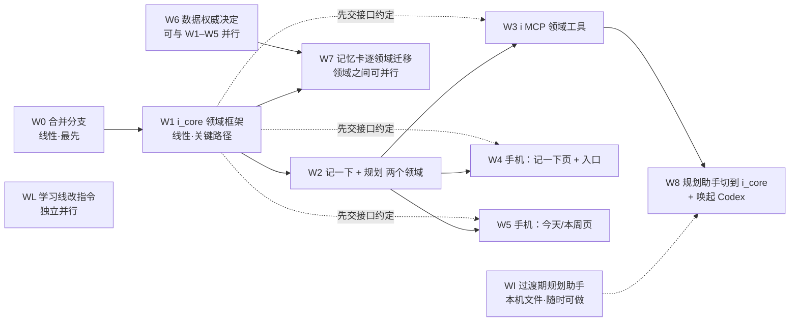

# 个人数据中枢：总规划与分窗口任务单（2026-10-05）

**用户已确认的原则（2026-10-05）**：i_core 是个人数据唯一的仓库；思源只管成篇的文字；各个 App 是看数据的窗户，各个 Agent 是干活的，两者都不各自存一份数据。

> **2026-10-05 第二轮**：用户已定宿主留在随身笔记本、手机林埃回复写入 i_core、i_remember 迁入 i_core；W6 草案已收进 `data-authority-preflight/` 并在 ADR 第 12 节合并。
>
> **2026-10-05 修订**：W1、W2、W5、W6、W7 五张卡已按 [个人数据中枢 ADR](PERSONAL_DATA_HUB_ADR_20261005.md) 改写，ADR 第 11 节的拍板项定下来之前，这几张卡不开工。其他卡受到的影响：
> - **W3**：`i_remember` 改写进 i_core `captures`（不再用本机账本和 47862 拉取通道）；加读 `plan_days` 的工具；i_memory 读取层的 policy 加领域白名单（ADR F8）。
> - **W4**：本地待发队列用 W7-0 的通用 outbox，不另建 `quick_captures` 表；捕获页底部显示两个处理者的结果。
> - **W8**：今日队列写 `plan_days`；`capture_sync` 用 `captures:read`、`captures:ack` 范围令牌，不用 worker 密钥。
> - **第 2 节现状表**有两处和代码不符：手机上林埃的回复不在 i_core；网页端"帮我记一下"的记录目前到不了手机。以 ADR 第 2 节为准。
> - **新增并行项**：W7-0（手机端前置）在 W1 约定定稿后即可开工。

本文给 Codex 分窗口执行用。每个窗口开工前先读本文的第 1～4 节，再读自己的任务卡（第 5 节）。

---

## 1. 原则

1. **一个仓库。** 结构化的个人数据都进 i_core，一个 SQLite 库，按领域分表。领域包括聊天、记一下、规划、收支、经期、睡眠摘要、招聘批次，以后还有学习账本。
2. **文字归思源。** 笔记、学习资料、复盘长文、教学设计留在思源。思源里出现的结构化数据，要么是从 i_core 单向生成的只读副本，要么由插件直接读 i_core 显示。**不做双向同步。**
3. **窗户不存数据。** Here I Am（手机）、思源（电脑）、FlexNote 都只是视图。在窗户里做的修改，要通过 i_core 的接口写回去，不在窗户里另存一份。
4. **Agent 走同一个接口。** 林埃的 worker、Codex、Claude 网页端都通过 i_core 的 API 读写，或通过包装这些 API 的 MCP（现在的 i 工具）读写。dot 只能读写文件，由 Codex 替它转一道。
5. **按领域授权。** 数据放在同一个库里，不等于谁都能看。每个令牌只授予它需要的领域。例如规划助手（Codex）拿不到私密聊天，读写权限也分开给。
6. **一步一步搬。** 新领域直接建在 i_core 里。已经在手机 Memory V3 里的数据，按领域逐个迁移，每个领域单独立项。迁移前先完成数据权威决定（见 W6）。
7. **原有边界不变。** 普通聊天不会自动变成 User-truth；Project Memory 和生活事实隔离；真实数据、令牌、私人内容不进 GitHub。这些都按 `AGENTS.md`。

## 2. 现状

| 数据 | 现在在哪 | 以谁为准 |
|---|---|---|
| 聊天记录 | i_core `chat_messages` | i_core |
| 手机活动（MDA） | i_core activity 域（默认关闭） | i_core |
| 收支、待办、睡眠、计划等记忆卡 | 手机 Memory V3（Drift） | 手机。电脑上只有 `tools/i_memory` 用 ADB 导出的只读快照 |
| "帮我记一下"的记录 | `tools/i_remote_mcp/.state/writeback.sqlite`，手机再拉取成记忆卡 | 先在 i_remote_mcp，再到手机 |
| 学习账本、招聘日历 | 思源数据库 | 思源 |
| 规划 | 方案写好了，**没建**（原计划放思源，现已作废） | 无 |
| 教招档案 | `D:\教师招聘备考系统` | 只读档案 |
| 健康 | COROS 手表 | COROS |

i_core 现在能做的：设备配对和令牌、聊天消息的幂等提交、按顺序的 change feed、每台设备的游标、worker 租约、activity 控制面。schema 是 5。它**还没有**领域表的通用做法，也没有按领域授权的令牌范围。

**分支**：下面这些都还没合进 `v3-lab`，有的已经在线上运行：
- `claude/b1-i-memory`、`claude/b2-remote-mcp`、`codex/continuity-*`：都已包含在 `claude/wonderful-carson-a26i9d` 里；
- `claude/b3-writeback`：比上面多两个提交，就是现在在用的两段式 `i_chat_turn`；
- `claude/wonderful-carson-a26i9d`：学习导师、教招规划；
- `claude/festive-ride-88vh1t`：规划助手、统筹、快速捕获设计、本文。

## 3. 目标形态

```
窗户：  Here I Am 手机（聊天 · 记一下 · 今天/本周）   思源（文章 · 只读看板）   FlexNote（画图）
           │                                          │
Agent：  林埃 worker   Codex（规划、学习）   Claude 网页端   dot（经文件）
           │  都只通过 i_core API / i MCP，令牌按领域授权
仓库：  i_core ── chat │ captures │ plan │ ledger │ cycle │ sleep │ … （同一个库，不同的表）
```

| 领域 | 表（暂定） | 谁写 | 谁读 | 哪个阶段 |
|---|---|---|---|---|
| 聊天 | 已有 | 手机、网页端、林埃 worker | 同左 | 已有 |
| 记一下 | `captures` | 手机、网页端（i_remember）、dot（经 Codex） | 规划助手 | W2 |
| 规划 | `plan_items`、`plan_weeks` | 规划助手 | 手机今日页、看板、网页端 | W2 |
| "帮我记一下"的记录 | 并入 `captures`，或单独设 `notes` | 网页端 | 手机、林埃 | W7 |
| 收支 | `ledger_entries` | 手机、林埃 worker | 看板、网页端 | W7（迁移） |
| 经期 | `cycle_entries` | 手机 | 林埃、看板 | W7（迁移） |
| 睡眠摘要 | `sleep_days` | COROS 导入 | 规划助手、林埃、看板 | W7 |
| 学习账本、招聘批次 | 待定 | 学习导师 | 规划助手 | W7 之后再评估，现在留在思源 |

## 4. 依赖关系：哪些必须先做，哪些可以同时做



**线性（必须按顺序做）**
1. **W0 合并分支**：所有窗口都要从同一个基线开工。
2. **W1 i_core 领域框架**：关键路径。它的**第一个产出是一份接口约定**（表的写法、令牌范围、各领域的 change feed、API 形状）。约定一定稿，W3、W4、W5 就可以先用假服务开工。
3. **W2 → W8**：规划助手要等 i_core 里真的有规划表、MCP 真的有规划工具，才能切过去。

**可以并行**
- W1 的接口约定定稿后，**W3、W4、W5 三个窗口同时做**：各自用假服务或测试夹具开发，W2 完成后再接真的。
- **WI 过渡期规划助手**：现在就能做，不依赖任何人。
- **W6 数据权威决定**：只写文档、做决定，可以和 W1～W5 同时进行。
- **WL 学习线**：按教招规划第 11 节改学习导师指令，和本文完全独立。
- **W7 各领域迁移**：要等 W1 和 W6 完成。之后收支、经期、睡眠等各领域之间可以并行，每个领域一个窗口。

**需要你本人做或明确授权的节点**
- 合入 `v3-lab`（W0，以及以后每个窗口的合并）。
- 在你电脑上升级正在运行的 i_core：停服务、备份、升级 schema（W2 上线时，W7 每次迁移时）。
- 把新版 App 装到你的主力手机上（W4、W5）。
- W6 的权威决定。

---

## 5. 任务卡

每张卡的格式：目标 / 依赖 / 产出 / 不做 / 验证 / 开场提示词。分支统一用 `codex/<卡号>-<短名>`，从 W0 之后的 `v3-lab` 开出。每个窗口完成后在 `DEVLOG.md` 顶部记一条，并在本文对应卡片标题后写"✅ 完成，分支/PR"。

### W0 合并分支（线性，最先）

- **目标**：把第 2 节列出的分支整理进 `v3-lab`，让后面的窗口有同一个基线。
- **依赖**：无。
- **产出**：一个整合分支和 PR。合并顺序：`claude/wonderful-carson-a26i9d` → `claude/b3-writeback` → `claude/festive-ride-88vh1t`。有冲突就逐个解决，CI 全绿。
- **不做**：不改任何功能；不 rebase、不 force-push（按 `AGENTS.md`）。
- **验证**：CI 全绿；`node --test tools/i_core tools/i_memory tools/i_remote_mcp` 全过；线上 i_remote_mcp 实际运行的提交，和合并后的代码一致（对比运行目录的 HEAD）。
- **开场提示词**：
  ```text
  读 docs/development/PERSONAL_DATA_HUB_PLAN_20261005.md 的第 2 节和 W0 卡。
  从 origin/v3-lab 开 codex/w0-integrate，依次合并 claude/wonderful-carson-a26i9d、
  claude/b3-writeback、claude/festive-ride-88vh1t（用 merge，不 rebase）。
  解决冲突，跑 node 测试和 CI，开 PR。合入 v3-lab 之前先问我。
  另外告诉我：我电脑上运行 i_remote_mcp 的目录现在在哪个提交，和合并结果有没有差别。
  ```

### W1 i_core 领域框架（线性，关键路径；2026-10-05 按 ADR 修订）

- **目标**：让 i_core 能承载会被修改、删除、合并的领域记录：统一的记录信封、字段级合并、墓碑、按领域的变更流、范围令牌和离线 intent 协议。实现不绑定 Windows，以后可以直接搬到常开主机。
- **依赖**：W0；[ADR](PERSONAL_DATA_HUB_ADR_20261005.md) 第 11 节决定 1、4～10、16 拍板（约定要用到）。
- **产出**：
  1. **先交接口约定** `docs/development/I_CORE_DOMAIN_CONTRACT.md`，用户确认后再写代码。必须写清：
     - 记录信封（ADR 4.1）和只追加的 `domain_ops` 操作表；`actor` 为用户的行就是 Core 端的用户修正记录；
     - 版本与合并（ADR 4.2、4.3）：带基准版本提交、字段级合并、四级 `actor`、`user_locked`、`stale_base`、`needs_resolution`；
     - 删除（ADR 4.4）：墓碑、30 天内恢复、到期清正文、墓碑挡住旧 ID 再创建；各领域可配置"删除立即清正文"；
     - 判重与合并（ADR 4.5）：领域判重键钩子、`duplicate_of`、`possible_duplicate`、显式 `merge` op；
     - intent 状态、错误码、TTL 和容量常量（ADR 4.7，写成版本化常量）；
     - 按领域的状态型变更流、cursor、ack、保留水位与 `resync_required`（ADR 4.8）；
     - 令牌范围 `<领域>:<动作>` 和主体表（ADR 第 6 节）；现有设备令牌默认只有聊天权限，行为不变；
     - 领域开关 `off / shadow / authoritative / frozen`（ADR 7.2）；
     - schema 5 → 6 只加表；迁移前自动离线备份；回滚说明；
     - API 形状：`POST /v1/core/domains/<领域>/ops`、`GET …/changes`、`POST …/ack`、`GET …/snapshot`、`GET …/records/<id>`；
     - 聊天的一处放宽（ADR 决定 4）：普通手机设备可以提交自己生成的 `companion` 消息，限定主角色、`origin_device_id` 是自己、不能带 `request_companion_reply`；
     - 宿主无关：核心路径不依赖 Windows；数据目录、监听地址、证书都走环境变量。

     约定定稿后在本卡标题后写"约定已定稿"，W3、W4、W5、W7-0 就可以开工。
  2. 实现：迁移框架、范围令牌、通用领域引擎（合并、墓碑、判重钩子、变更流、领域开关）、聊天 companion 放宽、一个最小示例领域，以及全套测试。
- **不做**：具体业务领域（W2、W7）；对象库（ADR 4.6 b，迁移通用记忆卡前另开卡）；搬宿主；不改 activity。
- **验证**：`node --test` 覆盖合并规则矩阵（同版本；不同字段并发；同字段不同等级；两个用户冲突进待处理；AI 改用户锁定字段被拒）、重发去重与 `idempotency_conflict`、删除后修改被拒、墓碑挡住旧 ID、到期清正文、领域开关各状态、旧令牌访问新领域被拒、cursor 落后返回 `resync_required`、普通设备提交 companion 的边界、重启后数据还在；从真实 schema 5 库的本机副本迁移成功（只用本机副本，结论不含数据）。
- **开场提示词**：
  ```text
  读 docs/development/PERSONAL_DATA_HUB_ADR_20261005.md（重点第 4、6、7.2 节和第 11 节的拍板结果）、
  PERSONAL_DATA_HUB_PLAN_20261005.md 的 W1 卡、data-authority/gate1a0/ 下的 AUTHORITY_ROOT 和 OUTBOX 两份 ADR，
  以及 tools/i_core/README.md、i_core_store.mjs、i_core_server.mjs。
  先只写 docs/development/I_CORE_DOMAIN_CONTRACT.md，写完给我看，不要先写代码。
  我确认后再实现迁移框架、范围令牌、通用领域引擎和聊天 companion 放宽。
  ```

### W2 记一下 + 规划两个领域（线性，依赖 W1；2026-10-05 按 ADR 修订）

- **目标**：在 i_core 里建 `captures`（网页端 i_remember 的记录也并进来）和规划三张表 `plan_items`、`plan_weeks`、`plan_days`。
- **依赖**：W1；ADR 决定 12、14、20 拍板。
- **产出**：所有表都按 W1 的领域约定建。
  - `captures`：原话、来源（`phone_quick` / `claude_web` / `dot` / `codex`）、记录时间、按处理者分开的处理结果（ADR 8.1：`organizer`、`planner` 各自的状态和产出 id）。作者可以改、可以删；`claude_web` 来源删除时立即清正文（B3 决定 2）；删除时记下需要连带处理的派生记录 id，删除本身由各领域执行（ADR 4.4）。
  - `plan_items`：字段按 `tools/life_planner/PLANNER_AGENTS.md` 的"规划库字段"，去掉思源专用部分；上级、前置、替代为都用 id；加 `remind_at`。判重键：规范化标题 + 截止或定时。手机令牌在这张表上只有 `plan:status`（完成、不做了）。
  - `plan_weeks`：每周预计和实际容量、各主线配额和完成块数、欠账。
  - `plan_days`：今日队列（有序的事项 id）、版本号、"这次改了什么"、待拍板、今晚关灯时间（ADR 8.2）。`today.md` 以后是它的投影。
  - 两个本机导入脚本，默认 dry-run：WI 的本机规划文件 → `plan_*`；i_remote_mcp 账本里的 `notes` → `captures`（保留 note_id、revision 和删除标记，已删除的不带正文）。
- **不做**：UI；MCP 工具和 i_remote_mcp 改写（W3）；排期逻辑（W8）。
- **验证**：node 测试覆盖重复提交、手机令牌只能改状态、规划令牌读不到聊天、`claude_web` 记录删除即清正文、两个处理者并发写处理结果互不覆盖、各领域变更流和 cursor，以及两个导入脚本的 dry-run 和重复运行。
- **开场提示词**：
  ```text
  读 PERSONAL_DATA_HUB_ADR_20261005.md 第 4、8 节、I_CORE_DOMAIN_CONTRACT.md、PERSONAL_DATA_HUB_PLAN_20261005.md 的 W2 卡、
  tools/life_planner/PLANNER_AGENTS.md 的规划库字段，以及 tools/i_remote_mcp/writeback.mjs 的 notes 表。
  按 W2 卡在 i_core 加 captures、plan_items、plan_weeks、plan_days 四个领域和两个导入脚本，写测试。
  上线到我电脑的步骤单独列出来，先不要执行。
  ```

### W3 i MCP 领域工具（W1 约定定稿后可开工，W2 完成后接真的）

- **目标**：Agent 用同一套工具读写规划和记一下。
- **产出**：在 `tools/i_remote_mcp` 加以下工具，按令牌范围开放：
  - `capture_add`、`capture_list`、`capture_ack`；
  - `plan_list`、`plan_upsert`、`plan_set_status`；
  - `week_get`、`week_set`。

  另外：
  - 提供一个**只在本机监听**的入口给 Codex 用，不带聊天读取权限；
  - claude.ai 网页端可以用 `capture_add`，也就是把"帮我记一下"写进 i_core。是否同时停用旧的 notes 账本，留到 W7。
- **不做**：不改现有 `i_chat_turn`、`i_context`、`i_recall` 的行为。
- **验证**：node 测试，包括权限测试（规划令牌读不到聊天）；用假的 core 跑端到端测试。
- **开场提示词**：
  ```text
  读 PERSONAL_DATA_HUB_PLAN_20261005.md、I_CORE_DOMAIN_CONTRACT.md 和 tools/i_remote_mcp/README.md。
  按 W3 卡加领域工具和给 Codex 的本机入口，先用假 core 开发和测试；W2 合入后再接真的。
  ```

### W4 手机：记一下页和入口（W1 约定定稿后可开工）

- **目标**：侧键双击两秒内开始说话，说完就发到 i_core。
- **产出**：按 `QUICK_CAPTURE_DESIGN_20261005.md` 第 3、4 节实现：
  - 入口：launcher alias"记一下"、图标长按改指向新页、下拉快捷开关；
  - 捕获页：本机流式识别、可以编辑、本地待发送队列、断网补发。
- **不做**：不复用旧的 `MemexRouter.submitInput`；不进聊天时间线；侧键长按设为数字助理先不做。
- **验证**：Flutter widget 测试，CI 的 Windows 构建；真机验证侧键双击能不能选到"记一下"、冷启动要多久（L3，需要用户的三星手机）。
- **开场提示词**：
  ```text
  读 PERSONAL_DATA_HUB_PLAN_20261005.md、QUICK_CAPTURE_DESIGN_20261005.md、I_CORE_DOMAIN_CONTRACT.md
  和 AGENTS.md。按 W4 卡在 App 里做记一下页和入口，先接一个假的 captures 接口；W2 合入后改接真的。
  真机安装前先问我。
  ```

### W5 手机：今天 / 本周页（W1 约定定稿后可开工；2026-10-05 按 ADR 修订）

- **目标**：在手机上看今日队列和本周进度，可以点"完成""不做了"；电脑不开时也能看、能点。
- **依赖**：W1 约定；W7-0 的通用 outbox 和本地副本（没就绪时先用假实现）；ADR 决定 3、18 拍板（本页是路线图"手机暂停新页面"的例外）。
- **产出**：
  - 订阅 `plan_days`、`plan_weeks`、`plan_items` 的变更流，存本地副本；
  - 今天页：按 `plan_days` 的顺序显示队列，以及"这次改了什么"、待拍板、今晚关灯时间、生成时间；
  - 本周页：各主线配额进度条；
  - "完成""不做了"作为 `plan:status` intent 进 outbox，本地立即显示并标"待同步"；被拒或进 `needs_resolution` 时给出提示；
  - 电脑离线提示："今日单生成于 X；新记的事等电脑上线后安排"；
  - 有 `remind_at` 的事项派生本地闹钟（复用 `CheckinService.scheduleReminderAlarm`）。
- **不做**：手机上不排程、不重排；旧日程面板先不动（W7-待办 再合并）。
- **验证**：widget 测试——假变更流推来新一版今日单后页面自动更新；离线点完成显示待同步，恢复后转为已接受；被拒时有提示；有 `remind_at` 的事项生成闹钟。CI 的 Windows 构建。真机安装前先问我。
- **开场提示词**：
  ```text
  读 PERSONAL_DATA_HUB_ADR_20261005.md 第 4.7、8 节、I_CORE_DOMAIN_CONTRACT.md、PERSONAL_DATA_HUB_PLAN_20261005.md 的 W5 卡，
  以及 tools/life_planner/PLANNER_AGENTS.md 的今日单格式。按 W5 卡做手机的今天/本周页，先用假变更流和假 outbox。
  ```

### W8 规划助手切到 i_core（依赖 W2、W3）

- **目标**：规划助手不再用思源数据库或本机文件，改用 i MCP 的规划工具；有新的"记一下"时自动唤起 Codex。
- **产出**：
  - 改写 `tools/life_planner/`：存储部分换成 MCP 工具，分诊、配额、队列、事件驱动这些规则不变；
  - `capture_sync.mjs` 简化成一个监视器：订阅 i_core 的 captures feed，有新内容时按 `QUICK_CAPTURE_DESIGN` 第 6 节的合批、限频、静默时段唤起 `codex exec`；
  - 今日单除了写 `today.md`，同时写回 `plan_items`，让手机能看到。
- **验证**：用假的 codex 测监视器；在真实环境跑一天。
- **开场提示词**：
  ```text
  读 PERSONAL_DATA_HUB_PLAN_20261005.md 和 W8 卡，以及 tools/life_planner/ 全部文件。
  把规划助手的存储改成 i MCP 规划工具，写监视器，迁移过渡期的本机文件（用 W2 的导入脚本）。
  ```

### WI 过渡期规划助手（随时可做，和其他窗口都不冲突）

- **目标**：基础设施做好之前，规划系统先能用起来。
- **产出**：规划助手改用本机文件存储，不建思源规划库：
  - `%USERPROFILE%\life-plan\plan.json`：存事项，字段和"规划库字段"一致；
  - `week.md`：本周配额和容量；
  - `today.md`：今日单。

  捕获先用两种方式：dot 通话里说"记一下"，或者在电脑上直接对 Codex 说。手机一键捕获等 W4。
- **验证**：按 `tools/life_planner/README.md` 装好，跑一次"出今日单"。
- **开场提示词**：
  ```text
  读 PERSONAL_DATA_HUB_PLAN_20261005.md 的 WI 卡和 tools/life_planner/ 全部文件。
  按 WI 改成本机文件存储（plan.json），不建思源规划库，然后帮我装好并出第一份今日单。
  ```

### W6 数据权威决定（只写文档，可以并行；2026-10-05 按 ADR 修订）

- **目标**：把 [ADR](PERSONAL_DATA_HUB_ADR_20261005.md) 和 [W6 草案](data-authority-preflight/W6_DATA_AUTHORITY_DECISION_DRAFT_20261005.md)（17 项待确认，ADR 第 12 节已做对照）合成正式决定；拍板后改写冲突的既有文档，并给每个要搬家的领域出字段映射表。
- **依赖**：无；领域映射表要用到 W1 约定。
- **产出**：
  1. 以 ADR 第 11 节为拍板清单（W6 的 17 项已在 ADR 第 12 节对照合并），用户逐条确认；结果写回 ADR 第 11 节，标"已定"。宿主、林埃回复入 i_core、i_remember 迁移三项已在 10/05 定下。
  2. 按 ADR 第 9 节改文：PRODUCT_ROADMAP（第 77、80、92 行和 §7）、CORE_SYNC_DATA_INVENTORY（第 30、46–52 行）、Gate 1A-0 附录（生活领域按 Formal32 的格式补行，不改已冻结的 32 行）、B3_WRITEBACK_DESIGN、QUICK_CAPTURE_DESIGN、本文第 2 节现状表。
  3. 领域映射表，每个领域一份，放 `docs/development/data-authority/hub/`：旧表和字段 → i_core 领域字段；ID 怎么保留；判重键；`actor` 怎么回填（旧数据记 `import`，带 `userCorrected` 标志的字段记 `user_direct`）；回滚时怎么重建旧表。先做收支、睡眠、经期、待办卡四份。
  4. 只读统计（读真实数据，先问用户）：用已有 i_memory 快照按 `type`、`structured_type` 计数；`type=note` 的白板卡数；收支卡数和账本行数的差。只报数字。
  5. 在本机核实 ADR 第 10 节里电脑上能查的几项：手机上林埃的回复是否进了 i_core、i_remember 记录的 `phone_status`、运行副本和仓库的差异。
- **不做**：不改代码，不动数据。

### W7 逐领域迁移（依赖 W1、W6；按 ADR 7.3 的顺序；2026-10-05 按 ADR 修订）

**W7-0 手机端前置**（W1 约定定稿后可开工，Flutter）

- 所有编辑入口（界面、林埃工具、日程勾选）按字段写 `user_corrections`，带 `actor`；
- 通用领域 outbox：把现有聊天待发队列推广到各领域，状态按 ADR 4.7；按领域的本地副本和 cursor；待同步覆盖层；`needs_resolution` 列表；
- 领域开关 `phone / shadow / core`：按领域决定写本地表还是提交 intent；
- 林埃的回复进待发队列，以 `companion` 提交（依赖 W1 的放宽）；
- 已切换的领域关掉启动去重和本地判重删除，改由 i_core 判重；
- 消费 `captures` 变更流（代替从没实现的 47862 拉取端），把 `claude_web` 来源的记录交给 Record Organizer；
- 林埃召回时，待同步的记录注入时标"未同步"。
- **验证**：单元和 widget 测试；离线写入 → 恢复补交 → 回执；在"写本地后、提交前、回执前"三处注入崩溃；重复回执幂等。

**每个领域都走的步骤**

1. 在 i_core 按 W6 映射表加领域定义：字段、判重键、权限；
2. 回填脚本：默认 dry-run，保留旧 ID，`actor` 按 W6 规则回填；
3. 影子期：手机同时写本地表和提交 intent（影子数据只给对账脚本读），每天出对账报告（条数、ID、金额合计、墓碑数），连续 7 天零差异；
4. 在副本上演练一次 ADR 7.2 的回滚；
5. 用户授权后冻结切换：停该领域旧写入和自动动作、排空待发队列、最终对账；停 Core、备份、升级，手机切开关；林埃 worker、i MCP、看板改读 i_core。一次只切一个领域；切换后出问题优先往前修，回退旧路径要另演练、另授权；
6. 切换满 4 周没有回滚，删除旧写入代码，旧表只读保留。

**领域顺序**

| 卡 | 领域 | 特别事项 |
|---|---|---|
| W7-收支 | `ledger` | 第一个搬家的手机数据。缺币种不默认人民币；未付款、退款不算支出；转账、奖励、罚款等类型先列明、不并入本批。账本行是金额的权威，收支记录卡改成由账本生成的展示；删收支卡同时删账本行（ADR 决定 15）；ai_finance 工具改为提交 intent；判重键沿用"金额 + 时间 ±2 小时" |
| W7-经期 | `cycle` | 只给手机权限；起止日、症状保留原值，未结束留空；节律由本地副本重新派生 |
| W7-睡眠 | `sleep_days` | 保存多段、多来源原始观测，`sleep_days` 是日视图；手机 COROS 同步以 `actor=import` 提交，按来源 + 日期幂等；手记的 `sleep_record` 卡作为另一来源并存 |
| W7-待办 | 并入 `plan_items` | 依赖 W2、W5 和 ADR 决定 13。状态映射 active → 待办、completed → 完成、cancelled → 放弃；时间字段映射到截止、定时、`remind_at`；主线留空，等 Codex 归类；Record Organizer 不再产出 task / schedule / plan 卡；日程面板改读规划副本 |
| W7-通用卡 | fact / event 记忆卡 | 等 ADR 决定 17 和对象库；白板 `type=note` 卡不迁 |
| — | Dreaming、节律、洞察、成长契约、话题 | 不迁，留在手机作派生产物；需要给网页端读时导出只读快照 |

- 上线前要用户停 Core、备份；真实数据的每次切换都要用户点头。

### WL 学习线（独立并行）

- 按 `docs/development/handoffs/TEACHER_EXAM_STUDY_PLAN_20261005.md` 第 11 节，和 `LIFE_PLAN_COORDINATION_20261005.md` 第 6 节的对齐要求，修改学习导师指令。
- 学习账本暂时留在思源，`study-quota.md` 的文件接口不变。到 W7 之后再评估要不要搬。

---

## 6. 推荐的开窗顺序

| 时间 | 同时开着的窗口 |
|---|---|
| 现在 | **W0**（合并）· **WI**（过渡期规划，让你明天就能用）· **WL**（学习线）· **W6**（权威决定，写文档） |
| W0 合入后 | **W1**（先交约定） |
| W1 约定定稿后 | **W1** 继续实现 · **W3** · **W4** · **W5**（后三个先接假服务） |
| W1 完成后 | **W2** |
| W2 完成后 | W3、W4、W5 接真服务 · **W8** |
| W6 定稿、W1 完成后 | **W7**，每个领域一个窗口 |

同时开的窗口最好不超过四个。每个窗口只改自己卡片里写的目录，碰到别人的目录先停下来问。
