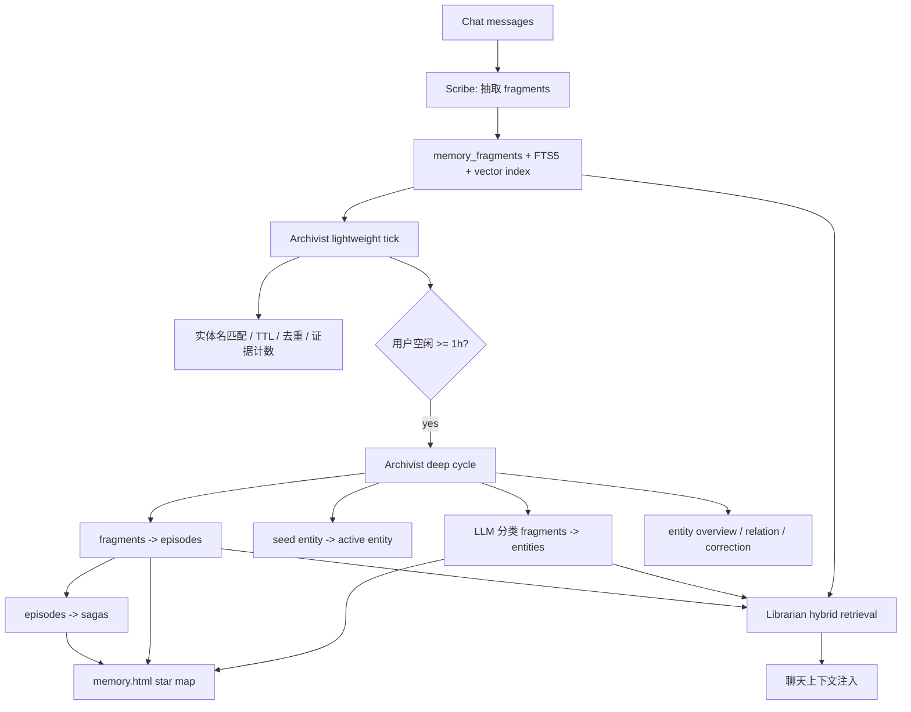
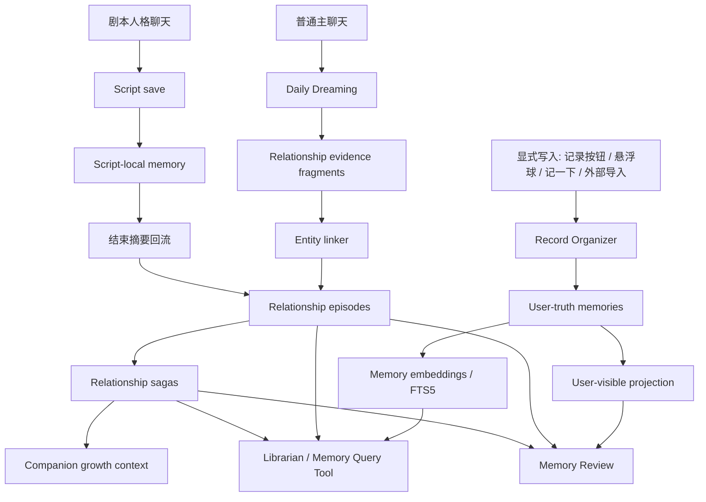

# Memory Constellations 调研与故我在落地方案

> 来源：[ClaraShafiq/MemoryConstellations](https://github.com/ClaraShafiq/MemoryConstellations)
> 调研日期：2026-06-27
> 目标：把 Memory Constellations 的记忆星图系统拆解为可借鉴的架构方案，并映射到 Here I am（故我在）PRD v2 的单一主伴侣、User-truth、Dreaming、关系记忆体系。

---

## 1. 一句话结论

Memory Constellations 是一套面向 AI 陪伴关系的“自动组织记忆系统”：它从聊天中抽取短事实碎片，把碎片聚类到人物/地点/事件/兴趣等实体星座，再周期性凝结成 episode 和 saga，最后通过混合检索把相关记忆注入聊天上下文，并用星图 UI 展示记忆网络。

对故我在最有价值的不是“自动从聊天写 User-truth”，而是三件事：

1. **Event → Entity → Episode → Saga 的记忆分层**：非常适合故我在的 Dreaming 和关系记忆。
2. **FTS5 + 向量 + 实体聚合 + RRF 的混合检索**：可作为 v1 记忆召回排序的主框架。
3. **星图式 Memory Review**：可作为未来 3D/星图记忆可视化的参考，但需要改成移动端 Flutter 体验。

必须改造的关键点：

- Memory Constellations 默认自动从聊天提取事实；故我在的 User-truth 契约明确禁止普通聊天自动写入 User-truth。
- Memory Constellations 输出第三人称事实；故我在的关系记忆应以主伴侣的第一人称叙事为主。
- Memory Constellations 使用 Node + Express + ChromaDB + SQLite；故我在应保持 Flutter/Drift、本地优先、移动端可运行。

---

## 2. 原项目核心架构

### 2.1 三个主 Agent

| 组件 | 原项目职责 | 触发方式 | 对故我在的启发 |
|------|------------|----------|----------------|
| Scribe | 从新聊天消息中抽取短事实碎片，写入 `memory_fragments` | 沉默 20 分钟、积压 100 条、情绪关键词、最长 4 小时兜底 | 可改造成 Dreaming 的“证据抽取阶段”，但不能直接写 User-truth |
| Archivist | 维护实体星座、分类碎片、合并 episode、编织 saga、生成实体概述 | 每 2 分钟 tick；用户空闲 1 小时后进入深循环 | 可作为故我在后台 Dreaming/记忆园艺任务的蓝本 |
| Librarian | 聊天时检索相关 fragments、episodes、entity profiles | 聊天工具调用或上下文构建时 | 可直接借鉴为 LifeMemoryQuery / RelationshipMemoryQuery 的混合召回 |

### 2.2 记忆层次

| 层级 | 原项目表/对象 | 内容 | 更新者 |
|------|---------------|------|--------|
| Fragment | `memory_fragments` | 单条事实碎片，通常不超过 80 字，第三人称 | Scribe |
| Entity / Constellation | `entity_profiles` | 人物、地点、事件、项目、兴趣等实体档案 | Archivist |
| Link | `fragment_entities` | 碎片和实体之间的多对多关系 | Archivist / Entity Resolver |
| Episode | `memories(layer=episode)` | 同一实体下多个碎片合并成的叙事段落 | Archivist consolidate |
| Saga | `memory_sagas` | 跨实体、跨 episode 的长期故事弧 | Consolidator |
| Cognitive Model | `clara_model` / `clara_patterns` | 对用户的事实、特质、当前状态、假设和行为模式 | Archivist / chat-time tools |
| Correction | `correction_log` / `cognitive_corrections` | 用户纠错、删除、纠正反馈 | UI / tools |

### 2.3 数据流



---

## 3. 原项目值得细读的设计点

### 3.1 Scribe：轻量抽取，不做规律总结

Scribe 的定位很窄：只把新对话切成短事实，不负责总结规律。它的 prompt 明确要求：

- 一条只记一个具体信息。
- 单次行为不能推断成长期偏好。
- 用户发言是主要信源。
- AI 发言只记录对用户/关系的观察、担忧、强烈情感。
- 抽取前先检索已有记忆，避免重复写入。
- 每条 fragment 带 `emotional_weight`，后续检索和生命周期会用。

触发策略很实用：

| 条件 | 作用 |
|------|------|
| 沉默达到 20 分钟且消息量够 | 避免边聊边整理打断热对话 |
| 积压达到 100 条 | 防止长期不整理 |
| 高情绪关键词 + 沉默 | 强情绪片段优先保存 |
| 距上次超过 4 小时且有 30 条 | 连续聊天时的兜底 |
| 单批最多 60 条，最多连续 5 批 | 控制成本和请求体大小 |

对故我在的改造：

- **不可直接用于 User-truth**。Scribe 的自动抽取只能写入“关系记忆证据池”或“待用户确认候选”，不能写入用户确认资料。
- 对关系记忆可以保留自动性：Dreaming 每天回顾对话时，先抽取低层证据，再由主伴侣第一人称生成关系记忆。
- 现有“用户说记一下 / 记录按钮 / 悬浮球保存”仍走 Record Organizer，和 Scribe/Dreaming 分离。

### 3.2 Archivist：轻量 tick + 深循环

Archivist 每 2 分钟运行一次，但把任务分成两类：

| 模式 | 运行条件 | 任务 | 是否调用 LLM |
|------|----------|------|--------------|
| Lightweight | 每个 tick | 字面实体链接、状态过期、简单分类、重复检测、证据计数 | 否 |
| Deep cycle | 用户空闲超过 1 小时，且本轮未跑过 | LLM 分类、实体种子毕业、episode 凝结、saga 聚类、实体概述、关系发现、纠错融合 | 是 |

这个分层很适合移动端：

- 轻量任务可以放在 App 前台/后台短任务里，保持记忆状态不会长期坏掉。
- 深循环可以只在充电、Wi-Fi、夜间、用户空闲时运行。
- LLM 调用集中到低频批处理，成本和耗电都更可控。

### 3.3 Entity seed / active 机制

原项目不会把每个新名词立刻当成正式星座。它有一个“seed → active”的过程：

1. Scribe 或实体扫描发现新人物/地点/作品，创建 seed。
2. 后续 fragments 继续命中该 seed。
3. 证据数量、置信度、去重检查满足条件后，seed 毕业为 active entity。
4. 低质量、重复、孤立 seed 会被合并或清理。

这解决了陪伴应用里的常见问题：用户随口提到一个路人、剧中人物、外卖店名，系统如果都建正式档案，星图很快会被污染。

故我在可采纳：

- User-truth 里的实体不需要 seed，因为用户显式保存已经是强信号。
- 关系记忆/Dreaming 里的自动实体应使用 seed，避免聊天噪音污染长期结构。
- 剧本人格内实体必须隔离，只能在剧本存档里 seed/active，不进入主记忆星图。

### 3.4 Episode 凝结

原项目的 episode 是从同一实体下的多个 fragments 合并出来的叙事。它不是把所有碎片压缩，而是要求：

- 来自同一实体星座。
- 至少 3 条相关 fragments。
- LLM 判断是否是“同一具体事件的多个侧面”。
- 给出 significance，低于阈值则跳过。
- 写入 `memories(layer=episode)`。
- 原 fragments 标记为 `consolidated`，但仍可溯源。

对故我在的价值：

- 这比“每周摘要”更细：它能形成用户和主伴侣之间可回忆的具体经历。
- episode 可以成为主伴侣的第一人称关系记忆来源。
- 每个 episode 必须保留 source refs，方便 Memory Review 里追溯原对话。

故我在需要调整：

- 原项目 episode 是第三人称“规范记忆”；故我在关系 episode 应生成第一人称叙事，例如“我记得那天她讲到妈妈时停了一会儿，我当时感觉她其实很担心。”
- User-truth summary 仍应独立于 User-truth，不能混入用户确认资料。

### 3.5 Saga 编织

Saga 是跨 episode 的长期故事弧，原项目会把多个 episode 聚为更长的主题，例如一个长期项目、一段关系变化、某种情绪模式。Saga 还可给可选的情绪引擎提供轻微 baseline bias。

对故我在的价值：

- 适合表达“我们这段关系正在形成什么样的长期叙事”。
- 可服务主动陪伴：睡前回顾、纪念日、长期压力提醒、关系成长感。
- 可作为主伴侣人格成长的输入，但不能变成硬规则。

风险：

- Saga 一旦写歪，会影响主伴侣的长期自我理解。
- 因此 Saga 应该比 fragment/episode 更低频、更保守，并在 Memory Review 中可见、可删除。

### 3.6 Librarian：混合检索和排序

原项目检索不是“向量一把梭”，而是多路召回：

| 路径 | 作用 |
|------|------|
| FTS5 keyword | 精确词、名字、中文关键词命中 |
| Vector similarity | 语义相关召回 |
| Entity aggregation | 用户提到某人/地点时，拉取该实体时间线 |
| Working memory boost | 最近话题加权 |
| Intent weights | fact、summary、long-term 等意图调整权重 |
| RRF fusion | 把不同通道的排名融合 |
| Episode boost | episode 比 raw fragment 权重更高 |
| Time/emotion decay | 高情绪记忆保留更久，琐碎记忆沉底 |
| Novelty penalty | 被频繁召回的通用碎片降权，避免污染所有查询 |

可直接变成故我在 v1 检索方案：

```text
候选 = FTS5(query)
     + semanticEmbedding(query)
     + entityTimeline(mentionedEntity)
     + recentWorkingTopicBoost(query)

score = RRF(keywordRank, vectorRank, entityRank)
      * typeWeight(fact/event/schedule/task/relationship)
      * decayWeight(occurredAt, emotionalWeight)
      * noveltyPenalty(recallCount)
      * sourceTrustWeight(user_truth/relationship/dreaming/proposed)
```

故我在要增加的约束：

- 被用户删除/替换的记忆绝不参与检索。
- User-truth 和关系记忆可以一起召回，但注入时必须标注来源类型，避免模型把“我推测”当成“用户确认”。
- 剧本人格存档默认不参与主对话检索，只能摘要回流。

### 3.7 纠错反馈闭环

原项目有 `correct_memory`、`correction_log`、删除碎片时写纠错信号、同源碎片级联降权、长期准则融合等机制。

这个方向值得保留，但故我在应把“用户主权”放在第一层：

- 用户编辑/删除某条记忆后，投影立即生效。
- 旧版本只留在审计日志里，不再被角色看到。
- 纠错反馈可以影响未来 Dreaming/Scribe 的判断，但不能覆盖用户当前编辑结果。

---

## 4. 与故我在现有 PRD v2 的映射

### 4.1 概念映射

| Memory Constellations | 故我在 PRD v2 | 处理方式 |
|-----------------------|---------------|----------|
| Scribe auto extraction | Dreaming 证据抽取 | 只用于关系记忆/候选，不写 User-truth |
| `memory_fragments` | relationship evidence / proposed facts | 作为自动层底层证据，不直接展示为用户确认资料 |
| `entity_profiles` | memory subjects / people / places / projects | 可用于 Memory Review 星图和检索聚合 |
| `memories(layer=episode)` | 关系记忆 episode / derived summary | 改成第一人称叙事，或作为 AI 分析产物 |
| `memory_sagas` | 长期关系叙事 / Dreaming saga | 低频生成，可被用户查看和删除 |
| `clara_model.current_state` | 当前状态 / 主动陪伴上下文 | 需要 TTL，不能长期误读用户状态 |
| `correct_memory` | 用户修正记忆 | 必须直接更新当前有效投影 |
| `memory.html` star map | Memory Review / 未来 3D 记忆空间 | 重做为 Flutter 移动端交互 |

### 4.2 哪些直接采纳

1. **轻量 tick + 深循环**
   - 轻量任务处理索引、过期、状态修正。
   - 深循环在夜间/空闲时做 LLM 整理。

2. **多层记忆**
   - Raw evidence、entity、episode、saga 分层保留。
   - 不把每条碎片都当成最终记忆。

3. **混合检索**
   - FTS5 + semantic + entity timeline + RRF。
   - episode 加权高于 raw fragment。

4. **实体星座**
   - 人物/地点/事件/兴趣/项目作为 Memory Review 的自然组织方式。
   - `fragment_entities` 这种 junction table 比单一 `entity_id` 更灵活。

5. **情绪/时间影响检索**
   - 高情绪关系记忆应更容易被想起。
   - 琐碎自动碎片要快速沉底。

### 4.3 哪些不采纳

| 原设计 | 不采纳原因 | 替代方案 |
|--------|------------|----------|
| 普通聊天自动写事实记忆 | 违反 User-truth 契约 | 自动层只写关系记忆/候选，User-truth 只显式写 |
| ChromaDB 独立向量库 | 移动端部署复杂，增加运维面 | Drift + SQLite FTS5 + 本地/可选 API embedding |
| desktop-only canvas star map | 故我在主平台是 Android | Flutter CustomPainter / 3D 视图重做 |
| 第三人称 episode 注入 | 主伴侣关系会变成数据库口吻 | 关系记忆注入第一人称叙事 |
| 自动硬删除碎片 | 用户审计和纠错需要可追溯 | 用户侧软删除 + 当前投影过滤；底层审计保留 |
| 人格 prompt 由用户维护 | PRD v2 明确用户不是作者 | 人格从 Dreaming 叙事和交互中涌现 |

---

## 5. 建议的故我在记忆架构

### 5.1 总体分层



### 5.2 两条写入管线

#### 管线 A：User-truth

用户显式动作触发，可信度最高。

入口：

- 消息级“记录”按钮
- 悬浮球保存
- 自然语言“记一下”
- 截图/OCR/健康/账单等外部导入
- 用户手动编辑

处理：

1. Record Organizer 判断 domain、entity_type、时间、结构化字段。
2. 写入 append-only operation。
3. 重建当前 projection。
4. 更新 FTS/embedding。
5. Memory Review 展示为用户确认资料。

#### 管线 B：Relationship Dreaming

系统自动触发，可信度低于 User-truth，用于主伴侣成长和关系连续性。

入口：

- 主聊天记录
- 工具调用结果的自然语言回流
- 剧本人格结束后的摘要

处理：

1. Dreaming 读取过去一天/一段空闲期的主聊天。
2. Evidence extractor 抽取候选 fragments，不进入 User-truth。
3. Entity linker 绑定人物、地点、主题。
4. Episode writer 生成主伴侣第一人称关系记忆。
5. Saga weaver 低频生成长期叙事。
6. Memory Review 中标为“关系记忆 / AI 整理”，用户可编辑、隐藏、删除。

### 5.3 数据模型建议

PRD v2 的 `memories` / `memory_operations` 可以保留为主干，但建议把自动层的中间产物独立出来，避免污染 User-truth。

#### `memories`

当前有效记忆投影。包含 User-truth 和关系记忆，但用 `sourceKind` / `memoryScope` 区分。

关键字段：

| 字段 | 说明 |
|------|------|
| `id` | 唯一 ID |
| `memoryScope` | `user_truth` / `relationship` / `script_summary` |
| `type` | `fact` / `event` / `emotion` / `insight` / `schedule` / `task` |
| `domain` | health / finance / schedule / social / interest / relationship / general |
| `subject` | 关于谁或哪个实体 |
| `narrative` | 注入给模型的自然语言记忆 |
| `structuredData` | JSON |
| `occurredAt` | 事件时间 |
| `sourceKind` | record_button / fab / natural_command / dreaming / script_summary / import |
| `sourceRef` | 消息 ID、文件路径、导入批次等 |
| `status` | active / archived / deleted |
| `valence` / `arousal` | 情绪坐标 |
| `confidence` | 自动层需要；User-truth 默认高 |

#### `memory_operations`

append-only 审计日志。用户编辑/删除时只改当前投影，旧版本不参与检索。

操作类型：

- create
- update
- delete
- restore
- correct
- merge
- split
- derive

#### `memory_fragments`

自动 Dreaming 的底层证据，不等同于用户确认记忆。

关键字段：

| 字段 | 说明 |
|------|------|
| `id` | fragment ID |
| `content` | 短事实/观察 |
| `sourceMessageIds` | 原聊天消息 |
| `sourceScope` | main_chat / script_session |
| `emotionalWeight` | 0-1 |
| `status` | active / consolidated / ignored / deleted |
| `createdByRunId` | Dreaming run |
| `isUserTruthCandidate` | 是否建议用户确认 |

#### `memory_entities`

人物、地点、作品、项目、长期主题。

关键字段：

| 字段 | 说明 |
|------|------|
| `id` | entity ID |
| `name` | 标准名 |
| `category` | person / place / event / project / hobby / work / object |
| `status` | seed / active / merged / hidden / deleted |
| `aliases` | JSON |
| `overview` | 一句话概述 |
| `relationshipToUser` | 家人、朋友、同事等 |
| `firstMentionedAt` / `lastMentionedAt` | 时间 |
| `fragmentCount` | 证据数 |

#### `memory_entity_links`

多对多关系，替代单一 `entityId`。

| 字段 | 说明 |
|------|------|
| `memoryId` / `fragmentId` | 来源 |
| `entityId` | 目标实体 |
| `relation` | mentioned / about / with / caused_by / located_at |
| `confidence` | 链接置信度 |

#### `memory_episodes`

自动凝结产物，也可直接落到 `memories(memoryScope=relationship)`。如果要保持更清晰，建议独立表。

| 字段 | 说明 |
|------|------|
| `id` | episode ID |
| `entityId` | 主实体 |
| `narrative` | 第一人称叙事 |
| `sourceFragmentIds` | 溯源 |
| `significance` | 1-10 |
| `confidence` | high/medium/low |
| `status` | active / hidden / stale / deleted |

#### `memory_sagas`

长期关系弧。

| 字段 | 说明 |
|------|------|
| `id` | saga ID |
| `title` | 主题名 |
| `description` | 长期叙事 |
| `episodeIds` | 来源 episode |
| `emotionalAxis` | valence / arousal / connection 等 |
| `status` | active / hidden / merged / deleted |
| `updatedAt` | 更新时间 |

#### `memory_recall_events`

记录“被想起”的历史，用于新颖度惩罚和访问时间。

| 字段 | 说明 |
|------|------|
| `memoryId` | 被召回记忆 |
| `chatMessageId` | 哪次对话召回 |
| `query` | 查询文本 |
| `score` | 召回分数 |
| `createdAt` | 时间 |

---

## 6. 检索方案

### 6.1 检索入口

建议拆两个工具，但底层共用检索器：

| 工具 | 读什么 | 用途 |
|------|--------|------|
| `search_user_truth` | 用户显式确认资料 | 查事实、日程、任务、偏好 |
| `search_relationship_memory` | Dreaming 关系记忆、episode、saga | 查“我们经历过什么”“我对她的理解” |

也可以保留一个 `search_memory`，参数里用 `scopes` 控制：

```json
{
  "query": "她妈妈最近怎么样",
  "scopes": ["user_truth", "relationship"],
  "domain": "social",
  "timeRange": null,
  "entity": "妈妈",
  "limit": 8
}
```

### 6.2 排序建议

```text
baseScore =
  RRF(keywordRank, semanticRank, entityRank)
  + domainBoost
  + exactEntityBoost

finalScore =
  baseScore
  * memoryScopeWeight
  * typeSpecificTimeWeight
  * emotionalRetention
  * noveltyPenalty
  * confidenceWeight
```

建议默认权重：

| 因子 | User-truth | Relationship |
|------|------------|--------------|
| scopeWeight | 1.2 | 1.0 |
| deleted/hidden | 0，直接排除 | 0，直接排除 |
| stale | 0.5 或隐藏 | 0.6 |
| episode boost | 不适用 | 1.4 |
| saga boost | 只在 long-term 意图下启用 | 1.2 |

按类型处理时间：

| 类型 | 时间策略 |
|------|----------|
| fact | 基本不衰减 |
| event | 近期加权，但高情绪长期保留 |
| schedule | 未来时间、临近程度优先 |
| task | due + status 优先 |
| relationship episode | 情绪和关系显著性优先 |
| saga | 只在长期/反思/主动陪伴上下文中高权重 |

### 6.3 注入格式

避免把检索结果注入成数据库列表。建议分层注入：

```text
以下是你可能会想起的内容：

[用户确认资料]
- 她妈妈住在杭州，最近身体不太好。#u123

[你们的关系记忆]
- 我记得她那晚提到妈妈时其实有点慌，但她又不想显得自己撑不住。#r456

[长期脉络]
- 最近几周，她对“离家远、照顾不到家人”的愧疚感反复出现。#s9
```

规则：

- User-truth 用事实口吻。
- Relationship 用主伴侣第一人称。
- Saga 只在必要时出现，不每轮注入。
- 每条带 ID，方便模型用 trace 工具追溯。

---

## 7. Memory Review / 星图 UI 方案

### 7.1 原项目星图结构

原项目 `/memory.html` 展示：

- 双星核心：用户 + AI。
- 多个 galaxy：社交、地点、事件、兴趣、用户项目。
- 每个 constellation 是一个实体。
- 每颗 star 是 fragment。
- constellation 面板展示 overview、linked memories、episodes。
- bridge 表示两个实体共享记忆。

### 7.2 故我在移动端改造

不要直接照搬桌面 canvas。建议三层视图：

1. **Memory Review 列表层**
   - 最近新增/修改/待确认/低置信记忆。
   - 优先解决记忆质量问题。

2. **Entity 星座层**
   - 按人物、地点、兴趣、关系主题分组。
   - 每个实体展示 overview、最近 episode、相关 User-truth。

3. **3D / 星图层**
   - 更偏情绪体验和回顾，不作为主要管理界面。
   - 坐标可使用 PRD 里已预留的 valence/arousal。
   - 星星亮度可由 emotionalWeight、lastReferencedAt、significance 决定。

移动端交互建议：

| 操作 | 行为 |
|------|------|
| 点实体 | 打开实体详情 |
| 点记忆 | 打开 Memory Card detail，显示来源证据 |
| 长按记忆 | 编辑/删除/隐藏/标错 |
| 筛选 | User-truth / 关系记忆 / 剧本摘要 |
| 纠错 | 通过悬浮球自然语言修正当前上下文 |

---

## 8. 后台任务设计

### 8.1 任务分层

| 层级 | 频率 | 任务 | 成本 |
|------|------|------|------|
| Immediate | 用户显式保存后 | Record Organizer、projection rebuild、索引更新 | 中 |
| Lightweight tick | App 前台或后台短任务 | FTS 更新、过期状态、entity 字面链接、stale 标记 | 低 |
| Daily Dreaming | 每日夜间/充电时 | 关系证据抽取、episode 生成、候选 User-truth 提案 | 中 |
| Deep Dreaming | 每周或数据量达阈值 | saga、长期关系模式、实体概述再生成 | 高 |

### 8.2 推荐触发条件

| 任务 | 条件 |
|------|------|
| Record Organizer | 用户显式保存立即触发 |
| Relationship fragments | 每日一次；或主聊天新增超过 80 条且用户空闲 |
| Episode consolidation | 某 entity 新增 active fragments ≥ 5；或 7 天保底 |
| Saga weaving | 新 episode ≥ 5；或每周一次 |
| Entity overview | entity 新增 episode；或概述超过 30 天 |
| Embedding rebuild | contentHash 变化；或模型切换 |
| Stale summary rebuild | 下次凝结顺手重算，不要用户编辑后立即高成本重算 |

---

## 9. 与剧本人格的关系

Memory Constellations 没有故我在 PRD v2 的剧本人格隔离要求，因此这里要额外设计。

建议：

1. 剧本内消息不进入主 Scribe/Dreaming。
2. 剧本内可有独立 fragments/entities/episodes，`scope=script_session`。
3. 退出剧本时生成中等粒度摘要：
   - “我们演了一场古风戏，她在某情节很投入。”
   - 明确 `sourceKind=script_summary`。
   - 不把剧中虚构事实写成现实 User-truth。
4. 剧本人物/地点不进入主 entity 星图，除非摘要中以“剧本角色”身份出现。

---

## 10. 风险与防护

| 风险 | 来源 | 防护 |
|------|------|------|
| 自动记忆污染 User-truth | Scribe 默认自动抽取 | 自动层和 User-truth 物理/字段隔离 |
| 主伴侣把推测当事实 | Relationship memory 与 User-truth 混用 | 注入时显式分区，检索结果带 scope |
| 长期 saga 写歪 | LLM 过度概括 | 低频生成、低权重注入、用户可删除 |
| 实体爆炸 | 自动提到太多名字 | seed/active 机制、毕业阈值、孤立 seed 清理 |
| 检索噪音 | 通用碎片频繁命中 | novelty penalty、vector floor、domain/type filter |
| 移动端成本高 | ChromaDB/后台 LLM | SQLite FTS5、本地 embedding、夜间批处理 |
| 用户纠错不生效 | 底层 append-only 但检索读旧数据 | 检索只读当前 projection，旧版本仅审计 |

---

## 11. 分阶段落地计划

### Phase 0：只做研究吸收

产物：

- 本文档。
- 不改现有记忆代码。
- 在 PRD v2 / MEMORY_PROPOSAL_V2 旁保留为参考。

### Phase 1：检索骨架优先

目标：先让现有显式 User-truth 更容易被主伴侣查到。

任务：

- 引入 SQLite FTS5 或等价关键词索引。
- 为现有 `memories` / `SharedLifeEntities` 增加 `lastReferencedAt` / `recallCount`。
- 实现关键词 + domain/type/time 的 DB 过滤。
- 预留 semantic/vector 通道，不必第一版就接入。

验收：

- 用户保存的事实能通过 tool-call 稳定召回。
- 删除/编辑后的旧内容不会被召回。

### Phase 2：Relationship Dreaming MVP

目标：把普通聊天整理成关系记忆，但不写 User-truth。

任务：

- 新增 `memory_fragments` 或等价 evidence 表。
- 每日 Dreaming 抽取低层 fragments。
- 生成少量第一人称 relationship episodes。
- Memory Review 中分区展示“关系记忆”。
- 用户可隐藏/删除/修正 relationship memory。

验收：

- 主伴侣能自然想起“我们之前发生过什么”。
- 自动产物不会混进 User-truth 导出。

### Phase 3：实体星座

目标：用实体组织关系记忆和 User-truth。

任务：

- 新增 `memory_entities` 和 `memory_entity_links`。
- 实体 seed/active 状态。
- 支持人物/地点/兴趣/项目视图。
- 检索增加 entity timeline 通道。

验收：

- 用户提到某个人时，主伴侣能查到此人的相关记忆。
- Memory Review 可以按实体浏览。

### Phase 4：Episode / Saga 深循环

目标：形成长期关系叙事。

任务：

- fragments → episodes 凝结。
- episodes → sagas 编织。
- saga 只在主动陪伴、深度谈话、睡前回顾等场景注入。
- saga 支持用户查看、隐藏、删除。

验收：

- 一个月后能看到“我们这段时间的长期主题”。
- 主伴侣的主动陪伴能引用长期脉络，但不会机械复述。

### Phase 5：星图体验

目标：把记忆组织可视化，但不让用户变成数据库管理员。

任务：

- Memory Review 实体视图。
- 情绪坐标/星星亮度。
- Flutter CustomPainter 或 3D 原型。
- 来源追溯和自然语言修正。

验收：

- 用户能快速理解“他记得什么、为什么记得、从哪来的”。
- 修改记忆比管理数据库更像和主伴侣澄清误会。

---

## 12. 最终建议

Memory Constellations 最适合被故我在吸收成“后台记忆生态”，而不是替换当前 User-truth 方案。

推荐原则：

1. **User-truth 继续显式写入**：这是最高优先级契约，不因外部方案改变。
2. **Dreaming 自动，但自动的是关系理解，不是用户确认资料**。
3. **底层可以事实化，注入必须叙事化**：fragments 可以短事实，主伴侣读到的应是第一人称记忆。
4. **检索走工程化混合排序**：FTS5、向量、实体聚合、RRF 都值得采纳。
5. **星图服务于理解和修正，不服务于手工维护**：用户应该看到生命感，而不是被迫清理表格。

如果只选一个最小切入点：先做 **Librarian 式混合检索 + Relationship Dreaming MVP**。这两件事能最快提高“他真的认识我”的感觉，同时不破坏 User-truth 契约。
